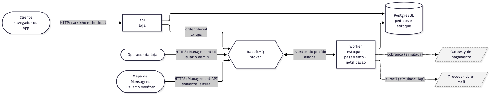
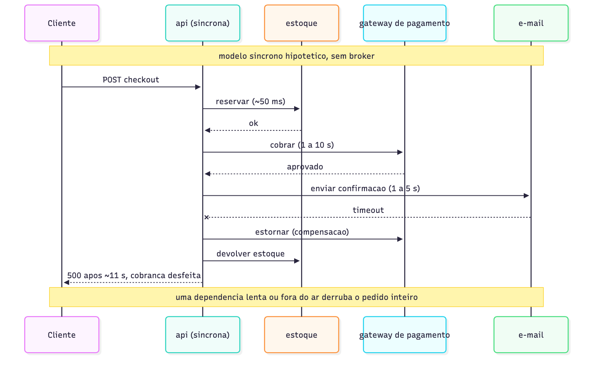

# message-queue-ecommerce
## Etapa 1: Descrição do Cenário

**Trabalho Prático de Mensageria** · Sistemas Distribuídos · FURB
Prof. Gabriel Castellani · Entrega: 17/09/2026

---

## 1. Contexto

Escolhemos o **comércio eletrônico**: o backend que processa os pedidos de uma loja
virtual de produtos físicos.

O cliente monta um carrinho, com o preço de cada produto congelado no momento em que
ele é adicionado. No checkout o carrinho vira pedido, e o sistema precisa então
registrar o pedido, reservar o estoque por um tempo limitado, cobrar o pagamento e
avisar o cliente. As quatro tarefas têm comportamentos bem diferentes:

| Tarefa | Tempo típico | Depende de terceiro | Essencial para a venda |
|---|---|---|---|
| Registrar o pedido | ~50 ms | Não | Sim |
| Reservar o estoque | ~100 ms | Não | Sim |
| Cobrar o pagamento | 1 a 10 s | Sim (gateway) | Sim |
| Notificar o cliente | 1 a 5 s | Sim (provedor de e-mail) | Não |



| Ator ou sistema | Papel |
|---|---|
| Cliente | Monta o carrinho e finaliza a compra pela API HTTP |
| `api` | Grava o carrinho e o pedido e publica o evento do checkout |
| `worker` | Consome os eventos: reserva estoque, cobra e notifica |
| Gateway de pagamento | Aprova ou recusa a cobrança. **Simulado**: recusa ~15 % ao acaso e pode simular indisponibilidade |
| Provedor de e-mail | Envia a confirmação. **Simulado**: a notificação vira uma linha de log |
| Operador da loja | Acompanha filas e mensagens com defeito pela Management UI do RabbitMQ |

**Carga esperada.** Num dia comum chega cerca de 1 pedido por segundo. Numa promoção
chegam rajadas de uns 500 pedidos por minuto, e o pagamento, que leva segundos por
pedido, vira o gargalo.

**Requisitos de negócio.**

1. **Nenhum pedido pode se perder.** É o evento de maior valor da loja.
2. **O checkout precisa responder na hora.** Espera no checkout aumenta o abandono.
3. **Ninguém é cobrado por um produto que acabou.** Com várias pessoas comprando ao
   mesmo tempo, a última unidade fica com quem reservou primeiro. Por isso o estoque é
   reservado **antes** da cobrança. A reserva dura 120 s: se o pagamento não terminar
   nesse prazo, ela expira e a unidade volta à venda, para que um checkout abandonado
   não prenda estoque.

O pedido termina em `PAID`, `DECLINED`, `OUT_OF_STOCK` ou `EXPIRED` (Etapa 2).

---

## 2. Por que comunicação assíncrona

### 2.1 O problema do modelo síncrono

Sem broker, o checkout faria as quatro tarefas em sequência e só responderia no fim:

```
POST /carts/{id}/checkout → grava → reserva → cobra → envia e-mail → 201
                           50 ms    100 ms    8 s       3 s
                           (cliente esperando ~11 s)
```



Isso causa cinco problemas:

- **a) Acoplamento no tempo.** O checkout fica tão lento quanto a soma das tarefas, e
  quem dita o tempo de resposta da loja passa a ser o gateway de pagamento, um sistema
  de terceiros.
- **b) Falha em cascata.** Se o provedor de e-mail cai, a transação inteira falha e a
  venda se perde por causa de uma tarefa que nem era essencial.
- **c) Acoplamento de código.** Cada nova reação ao pedido (fidelidade, nota fiscal,
  BI) obriga a mexer no checkout, que é a parte mais sensível do sistema.
- **d) Picos.** Com 500 pedidos por minuto e cada requisição presa por ~11 s, o
  servidor esgota as conexões e começa a recusar clientes. Não há onde guardar o
  excesso.
- **e) Escala tudo ou nada.** O gargalo é o pagamento, mas para escalá-lo é preciso
  replicar o processo inteiro.

### 2.2 Como a mensageria resolve

Colocamos o **RabbitMQ** entre o checkout e o processamento. A `api` só grava o pedido
e publica um evento; o resto consome esse evento por conta própria.

```
POST /carts/{id}/checkout → grava → publica evento → 201  (6 ms medidos)
                                          │
                                     [RabbitMQ] → notificação (recebe todos os eventos)
                                          │
                                  estoque (reserva) → pagamento
```

| Problema | O que o broker oferece |
|---|---|
| a) Acoplamento no tempo | Produtor e consumidor não precisam estar ativos juntos. A `api` responde assim que o broker confirma o recebimento |
| b) Falha em cascata | Se um consumidor cai, os outros seguem. As mensagens dele esperam na fila |
| c) Acoplamento de código | Quem publica não conhece quem consome. Um consumidor novo só precisa de uma fila e um *binding* |
| d) Picos | A fila absorve a rajada e os consumidores processam no ritmo que conseguem. O excesso é adiado, não recusado |
| e) Escala | Mais consumidores na mesma fila dividem o trabalho sem mudar o produtor. Na nossa versão os três consumidores rodam no mesmo processo, então escalamos o `worker` inteiro (`--scale worker=N`) |

A arquitetura completa, com retentativa, DLQ e expiração da reserva, está na Etapa 2:


### 2.3 Por que um broker e não HTTP em segundo plano

Daria para disparar as chamadas HTTP em segundo plano e responder `202` na hora. Isso
resolve a lentidão, mas não o primeiro requisito: se o processo morrer antes de
terminar o trabalho, o pedido some sem deixar rastro. O broker garante três coisas que
uma tarefa em segundo plano não garante:

- **Persistência.** A mensagem é gravada em disco e sobrevive a reinícios.
- **Confirmação (*ack*).** A mensagem só sai da fila quando o consumidor avisa que
  terminou. Se ele morrer no meio, ela volta e é processada de novo.
- **Distribuição.** Com vários consumidores na mesma fila, o broker reparte as
  mensagens sem o produtor saber quantos são.

Para isso valer de ponta a ponta, a `api` só responde `201` depois que o broker
confirma a publicação (*publisher confirm*), como detalhado na Etapa 2.
