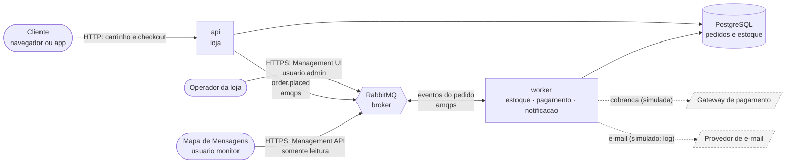
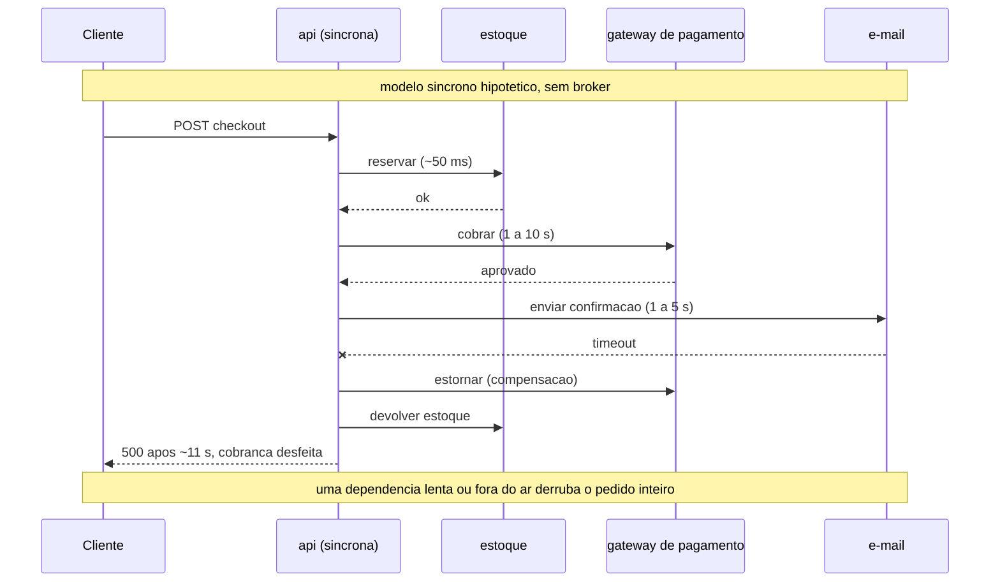

# message-queue-ecommerce
## Etapa 1 — Descrição do Cenário

**Trabalho Prático — Mensageria** · Sistemas Distribuídos · FURB
Prof. Gabriel Castellani · Entrega: 17/09/2026

---

## 1. Contextualização do ambiente

O domínio escolhido é o **comércio eletrônico** — especificamente, o backend de
processamento de pedidos de uma loja virtual que vende produtos físicos.

O cliente monta um **carrinho** (adiciona produtos com o preço do momento) e,
no **checkout**, o carrinho vira **pedido**. A partir daí o sistema precisa
executar quatro responsabilidades, nesta ordem: **registrar o pedido**,
**pré-reservar o estoque** por tempo limitado, **cobrar o pagamento** e
**notificar o cliente**. Num modelo síncrono ingênuo elas seriam tratadas como
uma operação única e indivisível, mas têm características de execução muito
diferentes:

| Responsabilidade | Latência | Depende de terceiro | Crítica para a venda |
|---|---|---|---|
| Registrar o pedido | ~50 ms | Não | **Sim** |
| Reservar o estoque | ~100 ms | Não | **Sim** |
| Cobrar o pagamento | 1 a 10 s | **Sim** (gateway) | **Sim** |
| Notificar o cliente | 1 a 5 s | **Sim** (provedor de e-mail) | Não |

### 1.1 Atores e sistemas externos

| Ator / sistema | Papel |
|---|---|
| Cliente | Monta o carrinho e finaliza a compra pela loja (HTTP) |
| Loja (`api`) | Recebe carrinho e checkout, grava o pedido e publica o evento |
| Processamento (`worker`) | Reserva estoque, cobra e notifica, consumindo eventos do broker |
| Gateway de pagamento | Terceiro que aprova ou recusa a cobrança — **simulado** na implementação (recusa aleatória de ~15 % e falha transitória configurável) |
| Provedor de e-mail | Terceiro que envia a confirmação — **simulado** na implementação (a notificação é uma linha de log) |
| Operador da loja | Acompanha filas e mensagens rejeitadas (DLQ) pela Management UI do RabbitMQ |


<details>
<summary>Fonte Mermaid (<code>diagramas/contexto.mmd</code>)</summary>


</details>

### 1.2 Perfil de carga

| Situação | Pedidos | Característica |
|---|---|---|
| Dia normal | ~1 pedido/s | Folga em todas as etapas |
| Promoção (pico) | ~500 pedidos/min, em rajadas | O pagamento (1 a 10 s por pedido) vira o gargalo; o checkout não pode esperar por ele |


Três requisitos de negócio delimitam o problema:

- **Nenhum pedido pode ser perdido.** O pedido é o evento de maior valor da
  operação.
- **A confirmação ao cliente precisa ser imediata.** Espera no checkout aumenta
  o abandono de carrinho.
- **Nenhum cliente é cobrado por um produto que não existe.** Com clientes
  comprando ao mesmo tempo, a última unidade é de quem a reservou primeiro — por
  isso o estoque é **pré-reservado antes** da cobrança. A reserva é temporária
  (120 s): se o pagamento não se concluir no prazo, ela expira e a unidade volta
  à venda, para que um checkout abandonado não prenda estoque. O pedido termina
  em `PAID`, `DECLINED`, `OUT_OF_STOCK` ou `EXPIRED` (detalhado na Etapa 2).

---

## 2. Justificativa da comunicação assíncrona via mensageria

### 2.1 O que o modelo síncrono provoca

Num modelo síncrono hipotético (sem broker), a requisição de checkout executa
as quatro etapas em sequência e só responde ao final:

```
POST /carts/{id}/checkout ──► grava ──► reserva estoque ──► cobra ──► envia e-mail ──► 201
                              (50ms)       (100ms)          (8s)         (3s)
                              └──────────── cliente esperando 11 s ─────────────┘
```

E quando o e-mail falha, a venda inteira é desfeita:


<details>
<summary>Fonte Mermaid (<code>diagramas/sincrono.mmd</code>)</summary>


</details>

Disso decorrem cinco problemas concretos:

**a) Acoplamento temporal.** A resposta é tão lenta quanto a soma das etapas. A
latência percebida na loja passa a ser determinada pelo gateway de pagamento,
um sistema de terceiros sobre o qual a loja não tem controle.

**b) Falha em cascata.** Se o provedor de e-mail está fora do ar, a chamada lança
exceção e a transação inteira falha. O cliente vê "erro ao finalizar o pedido" e
a venda é perdida por causa de uma etapa que não era crítica para a venda.

**c) Acoplamento estrutural.** Adicionar qualquer nova reação ao pedido (pontos
de fidelidade, painel de BI, emissão fiscal) exige modificar o código do
checkout. O componente mais sensível do sistema é alterado sempre que surge um
requisito periférico.

**d) Incapacidade de absorver picos.** Numa promoção, 500 pedidos chegam em um
minuto. Como cada requisição mantém uma conexão aberta por ~11 segundos, o
servidor esgota o pool de conexões e passa a recusar requisições. Não há onde
guardar o excesso de trabalho: ou ele é processado na hora, ou é rejeitado.

**e) Escalabilidade indivisível.** O gargalo é o pagamento, mas como tudo roda no
mesmo processo, escalá-lo significa replicar também o registro do pedido e o
envio de e-mail — que não estavam sobrecarregados.

### 2.2 Como a mensageria resolve

A solução introduz um **broker de mensagens (RabbitMQ)** entre o checkout e o
processamento. A API apenas registra o pedido e **publica um evento**; as demais
etapas consomem esse evento de forma independente.

```
POST /carts/{id}/checkout ──► grava ──► publica evento ──► 201 Created   (~6 ms medidos)
                                               │
                                               ▼
                                        [ RabbitMQ ] ──────────────► notificação
                                               │                   (recebe todos
                                               ▼                     os eventos)
                                     estoque (reserva) ──► pagamento
```

A arquitetura completa (4 exchanges, 6 filas, retentativa, DLQ e expiração da
reserva) fica assim — cada elemento é justificado na Etapa 2:


Cada problema é resolvido por uma propriedade específica do broker:

| Problema | Propriedade que resolve |
|---|---|
| a) Acoplamento temporal | **Desacoplamento no tempo.** Produtor e consumidor não precisam estar ativos ao mesmo tempo. A API responde assim que o broker confirma o recebimento; a latência do checkout deixa de depender do gateway |
| b) Falha em cascata | **Isolamento de falhas.** O consumidor de notificação estar fora do ar não afeta o produtor nem os outros consumidores. A mensagem aguarda na fila até que ele volte |
| c) Acoplamento estrutural | **Desacoplamento de identidade.** O produtor publica num *exchange*, não para destinatários nomeados. Um novo consumidor entra fazendo *binding*; nenhum código de quem publica é alterado |
| d) Picos de carga | **Amortecimento.** A fila absorve o pico e o trabalho é drenado no ritmo que os consumidores suportam. O excesso é adiado, não recusado |
| e) Escalabilidade indivisível | **Escalabilidade horizontal por consumidores concorrentes.** Mais consumidores na mesma fila dividem o trabalho sem mudar o produtor. O broker permite dimensionar cada fila separadamente (ex.: 5 consumidores de pagamento e 1 de notificação); na versão entregue os três handlers rodam no mesmo processo `worker`, então escala-se o `worker` inteiro (`--scale worker=N`) — ver Etapa 5, Limitações |

### 2.3 Por que um broker, e não chamadas HTTP em segundo plano

Uma alternativa mais simples seria manter as chamadas HTTP, apenas disparando-as
em segundo plano e respondendo `202 Accepted` de imediato. Isso resolveria a
latência, mas não o requisito de não perder pedidos: se o processo morrer entre a
resposta e a execução do trabalho, **a informação desaparece sem rastro**.

O broker oferece três garantias que uma chamada em segundo plano não oferece,
válidas para toda mensagem que ele já confirmou (*publisher confirm*): a API só
responde `201` depois dessa confirmação, e os consumidores só publicam seus
eventos dentro da mesma transação que muda o pedido (Etapa 2, §5):

- **Persistência** — a mensagem é gravada em disco e sobrevive à reinicialização
  do broker e dos consumidores.
- **Confirmação de processamento (*ack*)** — a mensagem só sai da fila depois que
  o consumidor confirma que terminou. Se ele morrer no meio, ela volta para a
  fila e é reprocessada.
- **Redistribuição automática** — com múltiplos consumidores na mesma fila, o
  broker distribui as mensagens entre eles sem que o produtor saiba quantos são.

---

*As decisões de arquitetura decorrentes deste cenário estão na Etapa 2.*
