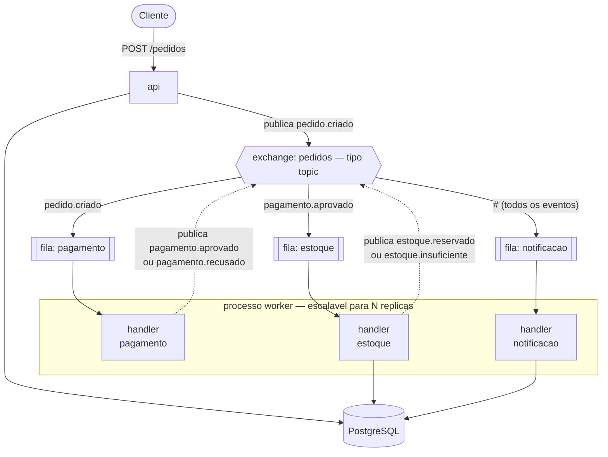
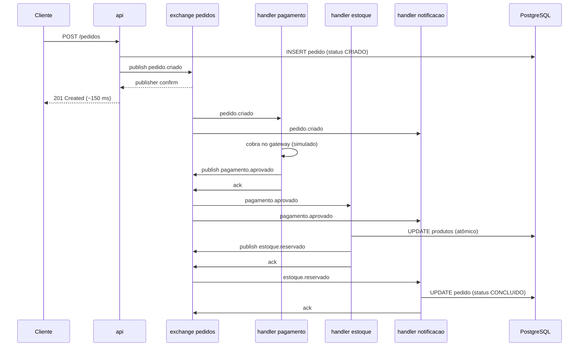
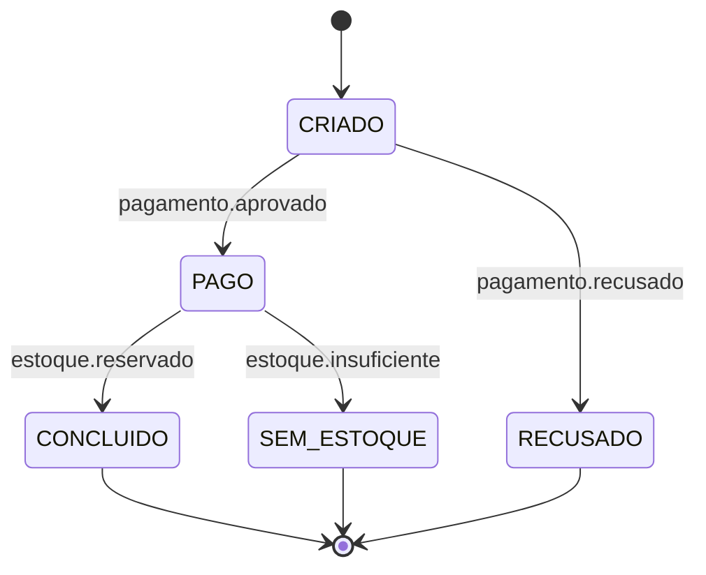
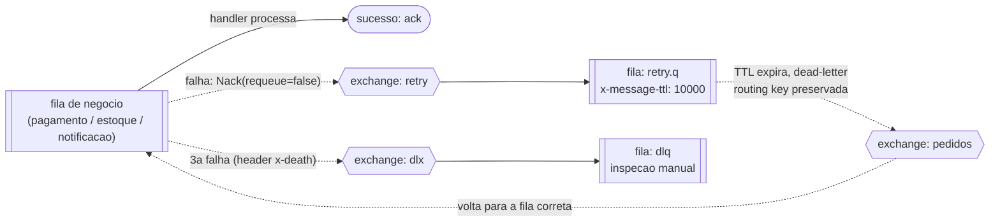
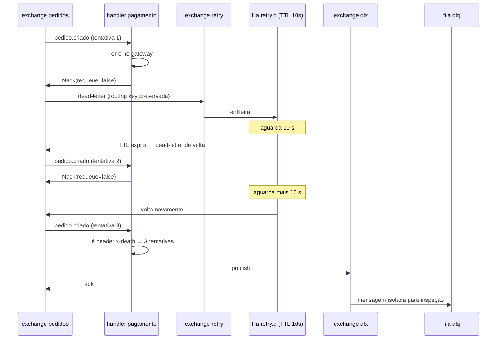

# message-queue-ecommerce
## Etapa 2 — Arquitetura da Solução

**Trabalho Prático — Mensageria** · Sistemas Distribuídos · FURB
Prof. Gabriel Castellani · Entrega: 17/09/2026

---

## 1. Componentes produtores e consumidores

A solução tem **dois processos** (`api` e `worker`), um broker **RabbitMQ** e um
banco **PostgreSQL**. Nenhum componente de negócio chama outro diretamente: toda
comunicação entre eles passa pelo broker.


<details>
<summary>Fonte Mermaid (<code>diagramas/arquitetura.mmd</code>)</summary>



</details>
ocorre fan-out:
  
  A->>X: publish pedido.criado        ← o publish                                                                                                                                    
  X->>P: pedido.criado                ┐ fan-out #1: api → { pagamento, notificacao }                                                                                                 
  X->>N: pedido.criado                ┘                                                                                                                                              

P->>X: publish pagamento.aprovado   ← o publish                                                                                                                                    
X->>E: pagamento.aprovado           ┐ fan-out #2: pagamento → { estoque, notificacao }                                                                                             
X->>N: pagamento.aprovado           ┘


### 1.1 Produtores

| Produtor | Gatilho | Publica |
|---|---|---|
| `api` | `POST /pedidos` | `pedido.criado` |
| handler `pagamento` | Fim da cobrança | `pagamento.aprovado`, `pagamento.recusado` |
| handler `estoque` | Fim da reserva | `estoque.reservado`, `estoque.insuficiente` |

### 1.2 Consumidores

| Consumidor | Fila | Consome | Responsabilidade |
|---|---|---|---|
| handler `pagamento` | `pagamento` | `pedido.criado` | Simula a cobrança no gateway |
| handler `estoque` | `estoque` | `pagamento.aprovado` | Reserva as unidades no banco |
| handler `notificacao` | `notificacao` | `#` | Notifica o cliente e atualiza o status |

Os handlers `pagamento` e `estoque` são simultaneamente consumidores e
produtores: consomem um fato e publicam o fato que resulta do seu
processamento. É isso que encadeia o fluxo sem que nenhum componente conheça o
próximo.

---

## 2. Fluxo de mensagens

### 2.1 Tipos de mensagem

Cinco tipos. A *routing key* é igual ao campo `tipo` do envelope, na convenção
`<agregado>.<fato-no-passado>` — o nome no passado deixa explícito que a mensagem
comunica algo que **já aconteceu**, e não uma ordem para que algo aconteça.

| Routing key | Publicado por | Consumido por |
|---|---|---|
| `pedido.criado` | `api` | `pagamento`, `notificacao` |
| `pagamento.aprovado` | `pagamento` | `estoque`, `notificacao` |
| `pagamento.recusado` | `pagamento` | `notificacao` |
| `estoque.reservado` | `estoque` | `notificacao` |
| `estoque.insuficiente` | `estoque` | `notificacao` |

Todas usam o mesmo envelope JSON:

```json
{
  "id": "550e8400-e29b-41d4-a716-446655440000",
  "tipo": "pagamento.aprovado",
  "pedido_id": "3a7b1e90-1234-4abc-8def-0123456789ab",
  "data": { "transacao_id": "TX-88213", "valor_centavos": 24990 }
}
```

`id` é a **chave de idempotência** — é por ele que o consumidor detecta
reentrega. `tipo` permite ao `notificacao`, que consome tudo, distinguir os
eventos. Data/hora e *content-type* não entram no corpo: já vêm nas propriedades
AMQP, e duplicá-los criaria duas fontes de verdade.

### 2.2 Exchanges, filas e bindings

Três exchanges, todos `topic` e duráveis: `pedidos` (barramento principal),
`retry` (mensagens que falharam) e `dlx` (mensagens que esgotaram as tentativas).

| Fila | Exchange | Binding key | Argumentos |
|---|---|---|---|
| `pagamento` | `pedidos` | `pedido.criado` | `x-dead-letter-exchange: retry` |
| `estoque` | `pedidos` | `pagamento.aprovado` | `x-dead-letter-exchange: retry` |
| `notificacao` | `pedidos` | `#` | `x-dead-letter-exchange: retry` |
| `retry.q` | `retry` | `#` | `x-message-ttl: 10000`, `x-dead-letter-exchange: pedidos` |
| `dlq` | `dlx` | `#` | — |

O *binding* de `notificacao` em `#` ao lado do de `estoque` em
`pagamento.aprovado` é o que produz o **fan-out**: o mesmo evento chega a dois
consumidores independentes, cada um fazendo coisa diferente, nenhum sabendo da
existência do outro.

### 2.3 Fluxo bem-sucedido


<details>
<summary>Fonte Mermaid (<code>diagramas/sequencia-feliz.mmd</code>)</summary>



</details>

O `201` sai antes de qualquer processamento — é o desacoplamento temporal da
Etapa 1 se concretizando.

### 2.4 Estados do pedido


<details>
<summary>Fonte Mermaid (<code>diagramas/estados.mmd</code>)</summary>



</details>

---

## 3. Estratégia de escalabilidade

**Competing consumers.** N instâncias do `worker` consomem da **mesma fila** e o
broker distribui as mensagens entre elas; nenhuma mensagem vai para mais de um
consumidor da mesma fila.

```
docker compose up --scale worker=3
```

Não há alteração de código, e o produtor não sabe quantos consumidores existem —
ele publica no *exchange*, não para instâncias.

**Prefetch.** Sem configuração de QoS, o broker entrega ao primeiro consumidor
tão rápido quanto ele aceita, e um único *worker* acumula a fila inteira no
buffer local enquanto os outros ficam ociosos. Com `prefetch = 10`, cada
consumidor mantém no máximo 10 mensagens não confirmadas e o trabalho se
distribui de fato. Baixo demais gera espera de rede entre mensagens; alto demais
anula a distribuição.

**Correção sob concorrência.** Escalar consumidores cria concorrência real, e
duas invariantes precisam de proteção explícita:

| Risco | Proteção |
|---|---|
| Dois *workers* leem `disponivel = 1` e ambos decrementam → venda acima do estoque | Verificação e escrita em **uma instrução atômica**: `UPDATE produtos SET disponivel = disponivel - $1 WHERE id = $2 AND disponivel >= $1`. Nenhuma linha afetada significa estoque insuficiente. `CHECK (disponivel >= 0)` é a última defesa |
| Não há ordenação entre filas: `estoque.reservado` pode ser processado antes de `pagamento.aprovado` → status anda para trás | `UPDATE` **monotônico**: só se aplica se o novo status for posterior ao atual na máquina de estados. Eventos fora de ordem tornam-se inofensivos |

Além disso, canais AMQP não são seguros para uso concorrente: cada handler opera
seu próprio canal sobre a conexão do processo.

**Limite.** O broker roda em nó único, o que o torna o ponto único de falha da
solução. Escalá-lo exigiria um *cluster* com filas *quorum*, deliberadamente
fora do escopo: com um único nó elas adicionam configuração e nenhum ganho.

---

## 4. Estratégia de confiabilidade

Objetivo: nenhuma mensagem é perdida. Quatro mecanismos, cada um cobrindo um
ponto distinto do caminho da mensagem.

| Mecanismo | Ponto de falha coberto | Como |
|---|---|---|
| *Publisher confirms* | O produtor achar que publicou quando o broker não recebeu | Canal em modo `confirm`; a `api` só responde `201` após o ACK do broker. Sem ACK, a operação é falha |
| Durabilidade | O broker reiniciar com mensagens em memória | Filas `durable` e mensagens com `delivery_mode: 2`, gravadas em disco |
| *Ack* manual pós-commit | O consumidor morrer depois de receber e antes de concluir | Ordem rígida: processar → gravar no banco → confirmar. Morrendo antes do *ack*, a mensagem volta para a fila |
| Idempotência | O mesmo trabalho ser executado duas vezes na reentrega | `INSERT INTO processados (id) VALUES ($1) ON CONFLICT DO NOTHING`, na mesma transação do efeito de negócio |

O consumo **nunca** usa `autoAck` — principal causa de perda silenciosa, pois o
broker descarta a mensagem no instante da entrega.

A idempotência é consequência direta do *ack* manual: como a mensagem volta à
fila quando o consumidor morre, a entrega é *at-least-once* e o mesmo evento pode
ser processado mais de uma vez. Se o `INSERT` não afeta linha alguma, a mensagem
já foi processada e o consumidor apenas confirma e segue.

---

## 5. Estratégia de tolerância a falhas

Falhas são classificadas em duas categorias, com tratamentos distintos:

| Categoria | Exemplo | Tratamento |
|---|---|---|
| **Transitória** | Gateway fora do ar, timeout de rede | Retentativa com espera |
| **Permanente** | JSON malformado, produto inexistente | Envio direto à DLQ |

Retentar falha permanente é desperdício: JSON quebrado não se conserta sozinho.


<details>
<summary>Fonte Mermaid (<code>diagramas/retentativa.mmd</code>)</summary>



</details>

**Retentativa.** O RabbitMQ não tem retentativa com espera nativa, mas ela é
obtida combinando duas funcionalidades que ele já oferece — TTL de mensagem e
*dead lettering* — sem escrever código de temporização. A fila de negócio
*dead-letter* a mensagem para o exchange `retry`, **preservando a routing key
original**; `retry.q` a segura por 10 s; o TTL expira e ela é *dead-lettered* de
volta ao exchange `pedidos`, ainda com a routing key original, retornando à fila
correta.

A alternativa ingênua seria `Nack(requeue: true)`, que recoloca a mensagem
imediatamente no início da fila. Com o gateway fora, isso produz um laço de falha
em altíssima frequência que satura broker e consumidor — uma negação de serviço
contra o próprio sistema.

**Dead letter queue.** O broker não limita tentativas, mas registra cada passagem
no cabeçalho `x-death`. O handler lê esse contador e, na terceira, publica no
exchange `dlx` e confirma a original. A DLQ cumpre duas funções: **isola o
defeito**, deixando as demais mensagens seguirem (evita o *head-of-line
blocking*, em que uma mensagem defeituosa trava a fila inteira), e **preserva a
evidência**, mantendo a mensagem íntegra com todo o histórico de tentativas para
inspeção e eventual republicação.


<details>
<summary>Fonte Mermaid (<code>diagramas/sequencia-falha.mmd</code>)</summary>



</details>

**Reconexão e encerramento.** Perder a conexão com o broker não encerra o
processo: ele reconecta com espera crescente. Ao receber `SIGTERM`, o *worker*
para de consumir, conclui a mensagem em andamento, confirma e só então encerra —
evitando reprocessamento desnecessário a cada reimplantação.

---

## 6. Justificativa das decisões

| Decisão | Escolhido | Alternativa descartada | Justificativa |
|---|---|---|---|
| Tipo de exchange | `topic` | `direct` | `direct` exige correspondência exata da *routing key*. O `notificacao` precisa receber todos os eventos (`#`) enquanto o `estoque` recebe apenas um tipo — exatamente o que o `topic` permite |
| Tipo de exchange | `topic` | `fanout` | `fanout` ignora a *routing key* e entrega tudo a todos. O `estoque` receberia `pedido.criado` e teria de filtrar em código. A filtragem pertence ao broker |
| Organização | 1 binário, N contêineres | 1 serviço por domínio | Processos separados só trariam ganho se houvesse necessidade de implantação independente, que não existe aqui. Os três handlers seguem logicamente separados — fila própria, *binding* próprio, responsabilidade própria; apenas a fronteira de processo foi unificada |
| Retentativa | TTL + *dead lettering* | `Nack(requeue: true)` | O requeue imediato gera laço de falha em alta frequência. O TTL fornece espera real sem código de temporização |
| Retentativa | 1 nível de 10 s | 3 níveis (5 s/30 s/2 min) | *Backoff* escalonado exigiria uma fila por nível por fila de negócio, para demonstrar o mesmo mecanismo |
| Contagem de tentativas | Cabeçalho `x-death` | Coluna contadora no banco | O broker já contabiliza. Uma segunda fonte de verdade precisaria ser mantida em sincronia |
| Tipo de fila | Clássica durável | *Quorum* | Filas *quorum* replicam entre nós. Com broker de nó único, adicionam configuração e nenhum benefício |
| Concorrência no estoque | `UPDATE` atômico único | `SELECT ... FOR UPDATE` | Uma instrução é menor **e** correta. O travamento explícito seria mais código para a mesma garantia |
| Garantia de entrega | *At-least-once* + idempotência | *Exactly-once* | *Exactly-once* não existe em sistemas distribuídos. A combinação adotada é o equivalente prático |
| Formato | JSON | Avro / Protobuf | Ambos exigem infraestrutura adicional (*schema registry* ou geração de código). JSON é legível diretamente no Management UI, o que tem valor na verificação e na apresentação |
| Persistência | PostgreSQL | Estado em memória | Os consumidores são replicados; estado em memória ficaria fragmentado entre as réplicas e produziria resultados incorretos sob escala |

---

*Continua na Etapa 3 — Configuração do RabbitMQ (entrega 24/09).*
