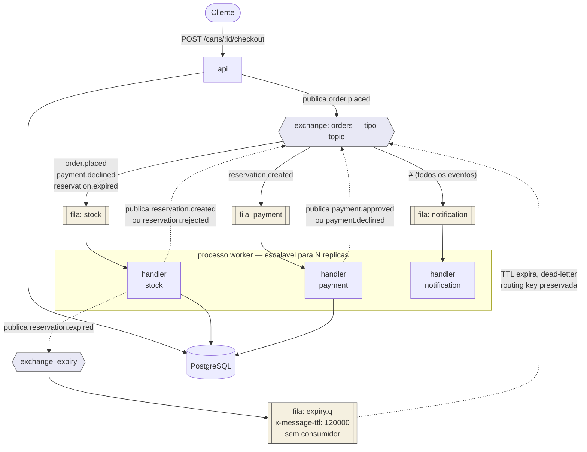
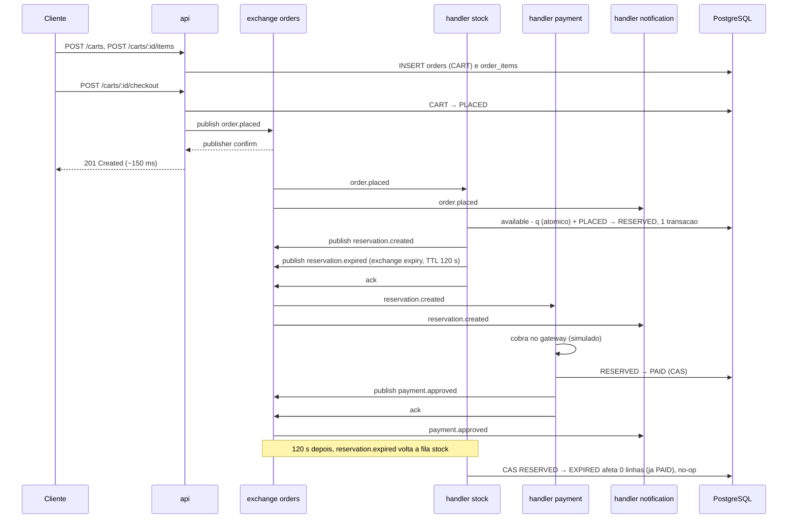
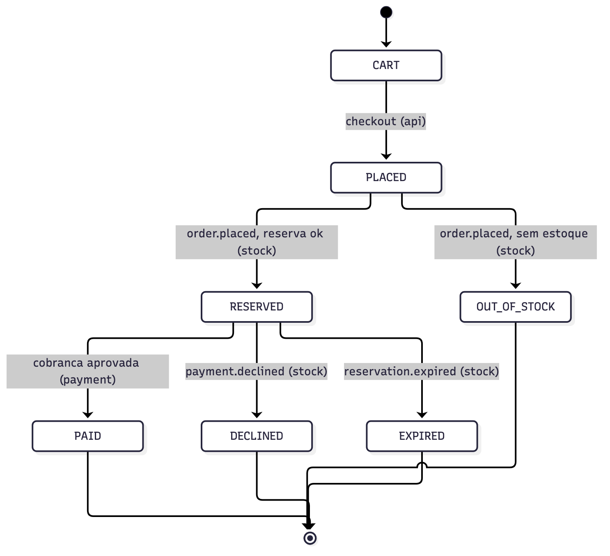
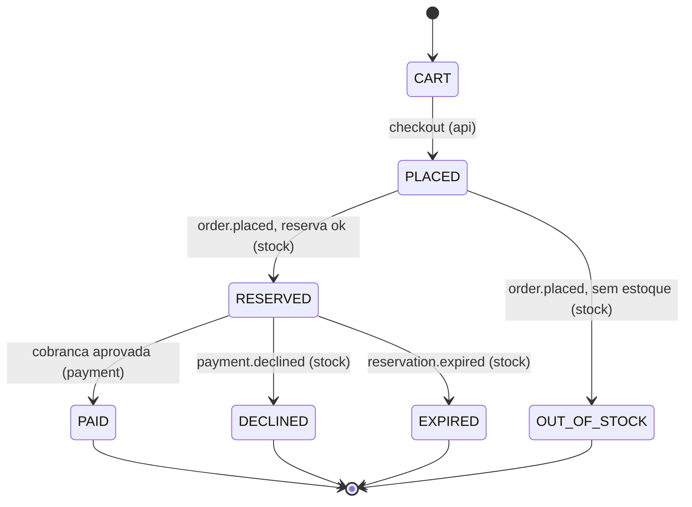
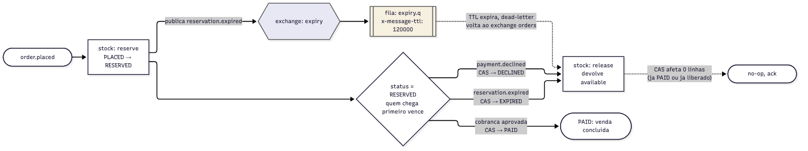
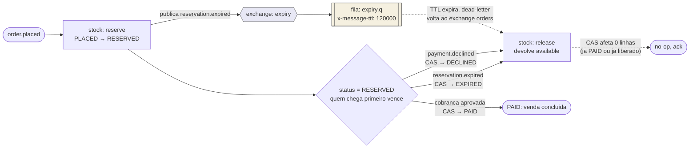
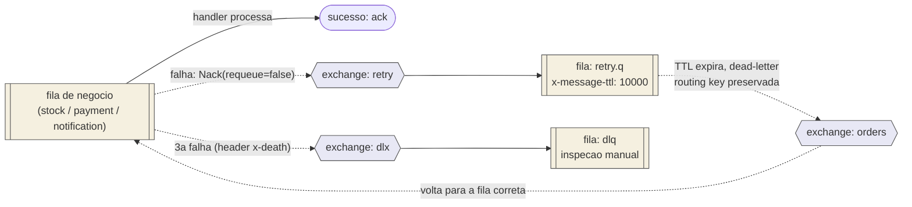
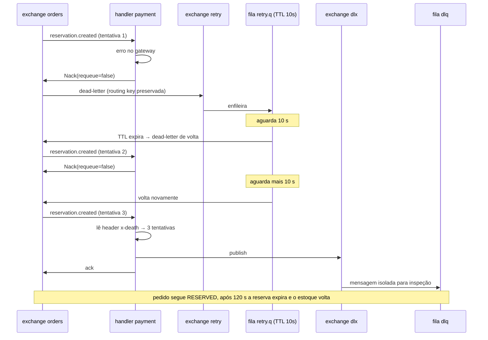

# message-queue-ecommerce
## Etapa 2 — Arquitetura da Solução

**Trabalho Prático — Mensageria** · Sistemas Distribuídos · FURB
Prof. Gabriel Castellani · Entrega: 17/09/2026

---

## 1. Componentes produtores e consumidores

A solução tem **dois processos** (`api` e `worker`), um broker **RabbitMQ** e um
banco **PostgreSQL**. Nenhum componente de negócio chama outro diretamente: toda
comunicação entre eles passa pelo broker.

O carrinho é HTTP puro: `POST /carts` e `POST /carts/:id/items` só gravam
no banco, sem mensageria. O fluxo assíncrono começa no checkout
(`POST /carts/:id/checkout`), e a ordem é **reservar o estoque antes de
cobrar**: o `payment` só recebe pedidos cujo estoque já está pré-reservado.


<details>
<summary>Fonte Mermaid (<code>diagramas/arquitetura.mmd</code>)</summary>


```mermaid
flowchart TB
    CLI([Cliente]) -->|"POST /carts/:id/checkout"| API[api]
    API -->|publica order.placed| EX{{"exchange: orders — tipo topic"}}

    EX -->|"order.placed<br/>payment.declined<br/>reservation.expired"| QS[[fila: stock]]
    EX -->|reservation.created| QP[[fila: payment]]
    EX -->|"#  (todos os eventos)"| QN[[fila: notification]]

    subgraph W["processo worker — escalavel para N replicas"]
        direction LR
        HS[handler<br/>stock]
        HP[handler<br/>payment]
        HN[handler<br/>notification]
    end

    QS --> HS
    QP --> HP
    QN --> HN

    HS -.->|"publica reservation.created<br/>ou reservation.rejected"| EX
    HP -.->|"publica payment.approved<br/>ou payment.declined"| EX
    HS -.->|publica reservation.expired| XE{{exchange: expiry}}
    XE --> QX[["fila: expiry.q<br/>x-message-ttl: 120000<br/>sem consumidor"]]
    QX -.->|"TTL expira, dead-letter<br/>routing key preservada"| EX

    API --> PG[(PostgreSQL)]
    HS --> PG
    HP --> PG

    classDef ex fill:#e8e8f5,stroke:#555
    classDef q fill:#f5f0e0,stroke:#555
    class EX,XE ex
    class QP,QS,QN,QX q
```

</details>

### 1.1 Produtores

| Produtor | Gatilho | Publica |
|---|---|---|
| `api` | `POST /carts/:id/checkout` | `order.placed` |
| handler `stock` | Fim da reserva | `reservation.created` (+ `reservation.expired` no exchange `expiry`), `reservation.rejected` |
| handler `payment` | Fim da cobrança | `payment.approved`, `payment.declined` |

### 1.2 Consumidores

| Consumidor | Fila | Consome | Responsabilidade |
|---|---|---|---|
| handler `stock` | `stock` | `order.placed` | Pré-reserva as unidades |
| | | `payment.declined`, `reservation.expired` | Libera a reserva e devolve o estoque |
| handler `payment` | `payment` | `reservation.created` | Simula a cobrança no gateway |
| handler `notification` | `notification` | `#` | Notifica o cliente (apenas lê; não altera o pedido) |

Os handlers `stock` e `payment` são simultaneamente consumidores e
produtores: consomem um fato e publicam o fato que resulta do seu
processamento. É isso que encadeia o fluxo sem que nenhum componente conheça o
próximo.

Cada handler grava no banco o status que o **seu** trabalho produz, na mesma
transação do efeito (ver §2.4 e §3). O `notification` não grava status: como
consome tudo e sem ordem garantida, não pode ser o dono do estado.

---

## 2. Fluxo de mensagens

### 2.1 Tipos de mensagem

Seis tipos. A *routing key* é igual ao campo `type` do envelope, na convenção
`<agregado>.<fato-no-passado>` — o nome no passado deixa explícito que a mensagem
comunica algo que **já aconteceu**, e não uma ordem para que algo aconteça.

| Routing key | Publicado por | Consumido por |
|---|---|---|
| `order.placed` | `api` | `stock`, `notification` |
| `reservation.created` | `stock` | `payment`, `notification` |
| `reservation.rejected` | `stock` | `notification` |
| `payment.approved` | `payment` | `notification` |
| `payment.declined` | `payment` | `stock`, `notification` |
| `reservation.expired` | `stock` (via `expiry.q`, 120 s depois) | `stock`, `notification` |

Todas usam o mesmo envelope JSON:

```json
{
  "id": "550e8400-e29b-41d4-a716-446655440000",
  "type": "payment.approved",
  "order_id": "3a7b1e90-1234-4abc-8def-0123456789ab",
  "data": { "transaction_id": "TX-88213", "amount_cents": 24990 }
}
```

`id` é a **chave de idempotência** — é por ele que o consumidor detecta
reentrega. `type` permite ao `notification`, que consome tudo, distinguir os
eventos. Data/hora e *content-type* não entram no corpo: já vêm nas propriedades
AMQP, e duplicá-los criaria duas fontes de verdade.

### 2.2 Exchanges, filas e bindings

Quatro exchanges, todos `topic` e duráveis: `orders` (barramento principal),
`retry` (mensagens que falharam), `dlx` (mensagens que esgotaram as tentativas)
e `expiry` (prazo das reservas).

| Fila | Exchange | Binding keys | Argumentos |
|---|---|---|---|
| `stock` | `orders` | `order.placed`, `payment.declined`, `reservation.expired` | `x-dead-letter-exchange: retry` |
| `payment` | `orders` | `reservation.created` | `x-dead-letter-exchange: retry` |
| `notification` | `orders` | `#` | `x-dead-letter-exchange: retry` |
| `retry.q` | `retry` | `#` | `x-message-ttl: 10000`, `x-dead-letter-exchange: orders` |
| `expiry.q` | `expiry` | `#` | `x-message-ttl: 120000`, `x-dead-letter-exchange: orders` |
| `dlq` | `dlx` | `#` | — |

O *binding* de `notification` em `#` ao lado dos *bindings* específicos é o que
produz o **fan-out**: `order.placed` chega a `stock` e `notification`;
`reservation.created`, a `payment` e `notification`; `payment.declined`, a
`stock` e `notification`. O mesmo evento chega a consumidores independentes,
cada um fazendo coisa diferente, nenhum sabendo da existência do outro.

`expiry.q` não tem consumidor: ela existe só para segurar a mensagem até o
TTL vencer (§2.5).

### 2.3 Fluxo bem-sucedido


<details>
<summary>Fonte Mermaid (<code>diagramas/sequencia-feliz.mmd</code>)</summary>


```mermaid
sequenceDiagram
    participant C as Cliente
    participant A as api
    participant X as exchange orders
    participant S as handler stock
    participant P as handler payment
    participant N as handler notification
    participant DB as PostgreSQL

    C->>A: POST /carts, POST /carts/:id/items
    A->>DB: INSERT orders (CART) e order_items
    C->>A: POST /carts/:id/checkout
    A->>DB: CART → PLACED
    A->>X: publish order.placed
    X-->>A: publisher confirm
    A-->>C: 201 Created (~150 ms)

    X->>S: order.placed
    X->>N: order.placed
    S->>DB: available - q (atomico) + PLACED → RESERVED, 1 transacao
    S->>X: publish reservation.created
    S->>X: publish reservation.expired (exchange expiry, TTL 120 s)
    S->>X: ack

    X->>P: reservation.created
    X->>N: reservation.created
    P->>P: cobra no gateway (simulado)
    P->>DB: RESERVED → PAID (CAS)
    P->>X: publish payment.approved
    P->>X: ack
    X->>N: payment.approved

    Note over X,S: 120 s depois, reservation.expired volta a fila stock
    S->>DB: CAS RESERVED → EXPIRED afeta 0 linhas (ja PAID), no-op
```

</details>

O `201` sai antes de qualquer processamento — é o desacoplamento temporal da
Etapa 1 se concretizando. A cobrança só começa depois que o estoque foi
reservado: o cliente nunca é cobrado por um produto que não existe.

### 2.4 Estados do pedido



<details>
<summary>Fonte Mermaid (<code>diagramas/estados.mmd</code>)</summary>


```mermaid
stateDiagram-v2
    [*] --> CART
    CART --> PLACED: checkout (api)
    PLACED --> RESERVED: order.placed, reserva ok (stock)
    PLACED --> OUT_OF_STOCK: order.placed, sem estoque (stock)
    RESERVED --> PAID: cobranca aprovada (payment)
    RESERVED --> DECLINED: payment.declined (stock)
    RESERVED --> EXPIRED: reservation.expired (stock)
    PAID --> [*]
    OUT_OF_STOCK --> [*]
    DECLINED --> [*]
    EXPIRED --> [*]
```

</details>

O carrinho **é** um pedido em status `CART` — não há tabela de carrinho. Cada
transição tem um único dono, que a grava na mesma transação do seu efeito:

| Transição | Gravada por | Gatilho |
|---|---|---|
| `CART → PLACED` | `api` | `POST /carts/:id/checkout` |
| `PLACED → RESERVED` | `stock` | `order.placed`, reserva bem-sucedida |
| `PLACED → OUT_OF_STOCK` | `stock` | `order.placed`, algum item sem estoque |
| `RESERVED → PAID` | `payment` | Cobrança aprovada |
| `RESERVED → DECLINED` | `stock` | `payment.declined` (devolve o estoque) |
| `RESERVED → EXPIRED` | `stock` | `reservation.expired` (devolve o estoque) |

Toda transição é um *compare-and-set* a partir do único status anterior válido:
`UPDATE orders SET status = $new WHERE id = $1 AND status = $previous`.
Nenhuma linha afetada significa que outro evento chegou antes — o handler não
faz nada e confirma a mensagem.

### 2.5 Ciclo da reserva



<details>
<summary>Fonte Mermaid (<code>diagramas/reserva.mmd</code>)</summary>


```mermaid
flowchart LR
    PC([order.placed]) --> R["stock: reserve<br/>PLACED → RESERVED"]
    R -->|publica reservation.expired| XE{{exchange: expiry}}
    XE --> QX[["fila: expiry.q<br/>x-message-ttl: 120000"]]
    QX -.->|"TTL expira, dead-letter<br/>volta ao exchange orders"| L

    R --> ST{"status = RESERVED<br/>quem chega primeiro vence"}
    ST -->|"cobranca aprovada<br/>CAS → PAID"| PAID([PAID: venda concluida])
    ST -->|"payment.declined<br/>CAS → DECLINED"| L["stock: release<br/>devolve available"]
    ST -->|"reservation.expired<br/>CAS → EXPIRED"| L
    L -.->|"CAS afeta 0 linhas<br/>(ja PAID ou ja liberado)"| NOOP([no-op, ack])

    classDef ex fill:#e8e8f5,stroke:#555
    classDef q fill:#f5f0e0,stroke:#555
    class XE ex
    class QX q
```

</details>

A reserva é **temporária**. Ao reservar, o `stock` subtrai as unidades de
`available` — é isso que impede outro cliente de reservá-las — e publica
`reservation.expired` no exchange `expiry`. A mensagem fica parada em `expiry.q` por 120 s e volta ao
barramento pelo mesmo mecanismo da retentativa (§5). Três eventos disputam a
reserva, e o primeiro a trocar o status `RESERVED` vence:

- **Pagamento aprovado** → `PAID`; as unidades já saíram de `available`, nada mais a fazer.
- **Pagamento recusado** → `DECLINED`; o `stock` devolve as unidades a `available`.
- **Prazo vencido** → `EXPIRED`; idem.

Quem chega depois encontra outro status e não faz nada. Assim, um carrinho
abandonado no meio do pagamento não prende estoque, e um produto pré-reservado
não pode ser vendido a outro cliente enquanto a reserva vale.

---

## 3. Estratégia de escalabilidade

**Competing consumers.** N instâncias do `worker` consomem da **mesma fila** e o
broker distribui as mensagens entre elas; nenhuma mensagem vai para mais de um
consumidor da mesma fila.

```
docker compose up --scale worker=3
```

Não há alteração de código, e o produtor não sabe quantos consumidores existem —
ele publica no *exchange*, não para instâncias.

**Prefetch.** Sem configuração de QoS, o broker entrega ao primeiro consumidor
tão rápido quanto ele aceita, e um único *worker* acumula a fila inteira no
buffer local enquanto os outros ficam ociosos. Com `prefetch = 10`, cada
consumidor mantém no máximo 10 mensagens não confirmadas e o trabalho se
distribui de fato. Baixo demais gera espera de rede entre mensagens; alto demais
anula a distribuição.

**Correção sob concorrência.** Escalar consumidores cria concorrência real, e
três riscos precisam de proteção explícita:

| Risco | Proteção |
|---|---|
| Dois clientes fazem checkout do último item (`available = 1`); dois *workers* leem 1 e ambos reservam → venda acima do estoque | Verificação e escrita em **uma instrução atômica**: `UPDATE products SET available = available - $1 WHERE id = $2 AND available >= $1`. Nenhuma linha afetada significa estoque insuficiente: um pedido fica `RESERVED`, o outro `OUT_OF_STOCK`. Todos os itens do pedido são reservados na mesma transação. `CHECK (available >= 0)` é a última defesa |
| A fila `payment` acumula além de 120 s (ex.: *worker* parado); a reserva expira e devolve o estoque, e depois o pagamento cobra mesmo assim → cliente cobrado por unidade já revendida | Status como *compare-and-set*, gravado pelo handler que causa a transição: `UPDATE orders SET status = $new WHERE id = $1 AND status = $previous`. `PAID` e `EXPIRED` exigem ambos `status = 'RESERVED'`; só um vence. Se o `payment` perde, a reserva já expirou: estorno simulado, nada é publicado |
| Não há ordenação entre filas: eventos do mesmo pedido chegam fora de ordem | O mesmo *compare-and-set*: um evento que chega fora de ordem não encontra o status anterior esperado e é ignorado |

Além disso, canais AMQP não são seguros para uso concorrente: cada handler opera
seu próprio canal sobre a conexão do processo.

**Limite.** O broker roda em nó único, o que o torna o ponto único de falha da
solução. Escalá-lo exigiria um *cluster* com filas *quorum*, deliberadamente
fora do escopo: com um único nó elas adicionam configuração e nenhum ganho.

---

## 4. Estratégia de confiabilidade

Objetivo: nenhuma mensagem é perdida. Quatro mecanismos, cada um cobrindo um
ponto distinto do caminho da mensagem.

| Mecanismo | Ponto de falha coberto | Como |
|---|---|---|
| *Publisher confirms* | O produtor achar que publicou quando o broker não recebeu | Canal em modo `confirm`; a `api` só responde `201` após o ACK do broker. Sem ACK, a operação é falha |
| Durabilidade | O broker reiniciar com mensagens em memória | Filas `durable` e mensagens com `delivery_mode: 2`, gravadas em disco |
| *Ack* manual pós-commit | O consumidor morrer depois de receber e antes de concluir | Ordem rígida: processar → gravar no banco → confirmar. Morrendo antes do *ack*, a mensagem volta para a fila |
| Idempotência | O mesmo trabalho ser executado duas vezes na reentrega | `INSERT INTO processed_messages (id) VALUES ($1) ON CONFLICT DO NOTHING`, na mesma transação do efeito de negócio |

O consumo **nunca** usa `autoAck` — principal causa de perda silenciosa, pois o
broker descarta a mensagem no instante da entrega.

A idempotência é consequência direta do *ack* manual: como a mensagem volta à
fila quando o consumidor morre, a entrega é *at-least-once* e o mesmo evento pode
ser processado mais de uma vez. Se o `INSERT` não afeta linha alguma, a mensagem
já foi processada e o consumidor apenas confirma e segue. O *compare-and-set* de
status (§3) é uma segunda barreira: uma transição reentregue não encontra mais o
status anterior e não se repete.

---

## 5. Estratégia de tolerância a falhas

Falhas são classificadas em duas categorias, com tratamentos distintos:

| Categoria | Exemplo | Tratamento |
|---|---|---|
| **Transitória** | Gateway fora do ar, timeout de rede | Retentativa com espera |
| **Permanente** | JSON malformado, produto inexistente | Envio direto à DLQ |

Retentar falha permanente é desperdício: JSON quebrado não se conserta sozinho.


<details>
<summary>Fonte Mermaid (<code>diagramas/retentativa.mmd</code>)</summary>


```mermaid
flowchart LR
    Q[["fila de negocio<br/>(stock / payment / notification)"]]
    Q -->|handler processa| OK([sucesso: ack])
    Q -.->|"falha: Nack(requeue=false)"| RX{{exchange: retry}}
    RX --> RQ[["fila: retry.q<br/>x-message-ttl: 10000"]]
    RQ -.->|"TTL expira, dead-letter<br/>routing key preservada"| EX{{exchange: orders}}
    EX -.->|volta para a fila correta| Q
    Q -.->|"3a falha (header x-death)"| DX{{exchange: dlx}}
    DX --> DLQ[["fila: dlq<br/>inspecao manual"]]

    classDef ex fill:#e8e8f5,stroke:#555
    classDef q fill:#f5f0e0,stroke:#555
    class RX,EX,DX ex
    class Q,RQ,DLQ q
```

</details>

**Retentativa.** O RabbitMQ não tem retentativa com espera nativa, mas ela é
obtida combinando duas funcionalidades que ele já oferece — TTL de mensagem e
*dead lettering* — sem escrever código de temporização. A fila de negócio
*dead-letter* a mensagem para o exchange `retry`, **preservando a routing key
original**; `retry.q` a segura por 10 s; o TTL expira e ela é *dead-lettered* de
volta ao exchange `orders`, ainda com a routing key original, retornando à fila
correta.

**Dead letter queue.** O broker não limita tentativas, mas registra cada passagem
no cabeçalho `x-death`. O handler lê esse contador e, na terceira, publica no
exchange `dlx` e confirma a original. A DLQ cumpre duas funções: **isola o
defeito**, deixando as demais mensagens seguirem (evita o *head-of-line
blocking*, em que uma mensagem defeituosa trava a fila inteira), e **preserva a
evidência**, mantendo a mensagem íntegra com todo o histórico de tentativas para
inspeção e eventual republicação.


<details>
<summary>Fonte Mermaid (<code>diagramas/sequencia-falha.mmd</code>)</summary>


```mermaid
sequenceDiagram
    participant X as exchange orders
    participant P as handler payment
    participant R as exchange retry
    participant RQ as fila retry.q (TTL 10s)
    participant D as exchange dlx
    participant DLQ as fila dlq

    X->>P: reservation.created (tentativa 1)
    P->>P: erro no gateway
    P->>X: Nack(requeue=false)
    X->>R: dead-letter (routing key preservada)
    R->>RQ: enfileira
    Note over RQ: aguarda 10 s
    RQ->>X: TTL expira → dead-letter de volta

    X->>P: reservation.created (tentativa 2)
    P->>X: Nack(requeue=false)
    Note over RQ: aguarda mais 10 s
    RQ->>X: volta novamente

    X->>P: reservation.created (tentativa 3)
    P->>P: lê header x-death → 3 tentativas
    P->>D: publish
    P->>X: ack
    D->>DLQ: mensagem isolada para inspeção
    Note over X,DLQ: pedido segue RESERVED, após 120 s a reserva expira e o estoque volta
```

</details>

**Expiração da reserva.** O prazo da reserva (§2.5) usa exatamente o mesmo
mecanismo, com outro TTL: `expiry.q` tem `x-message-ttl: 120000` e
`x-dead-letter-exchange: orders`, e ninguém a consome. Nenhum código de
temporização, nenhum *cron*, nenhuma dependência nova. Isso também cobre a falha
acima: um pagamento que foi para a DLQ não prende o estoque, porque a reserva
expira sozinha. Limitação conhecida: se o *worker* morrer entre o *commit* da
reserva e a publicação da mensagem de expiração, aquela reserva não expira — é a
mesma lacuna entre *commit* e *publish* que o padrão *Outbox* resolveria,
deliberadamente fora do escopo.

**Reconexão e encerramento.** Perder a conexão com o broker não encerra o
processo: ele reconecta com espera crescente. Ao receber `SIGTERM`, o *worker*
para de consumir, conclui a mensagem em andamento, confirma e só então encerra —
evitando reprocessamento desnecessário a cada reimplantação.

---

## 6. Justificativa das decisões

| Decisão | Escolhido | Alternativa descartada | Justificativa |
|---|---|---|---|
| Tipo de exchange | `topic` | `direct` | `direct` exige correspondência exata da *routing key*. O `notification` precisa receber todos os eventos (`#`) enquanto o `payment` recebe apenas `reservation.created` — exatamente o que o `topic` permite |
| Tipo de exchange | `topic` | `fanout` | `fanout` ignora a *routing key* e entrega tudo a todos. O `payment` receberia `order.placed` e poderia cobrar sem reserva, ou teria de filtrar em código. A filtragem pertence ao broker |
| Organização | 1 binário, N contêineres | 1 serviço por domínio | Processos separados só trariam ganho se houvesse necessidade de implantação independente, que não existe aqui. Os três handlers seguem logicamente separados — fila própria, *binding* próprio, responsabilidade própria; apenas a fronteira de processo foi unificada |
| Retentativa | TTL + *dead lettering* | `Nack(requeue: true)` | O requeue imediato gera laço de falha em alta frequência. O TTL fornece espera real sem código de temporização |
| Retentativa | 1 nível de 10 s | 3 níveis (5 s/30 s/2 min) | *Backoff* escalonado exigiria uma fila por nível por fila de negócio, para demonstrar o mesmo mecanismo |
| Contagem de tentativas | Cabeçalho `x-death` | Coluna contadora no banco | O broker já contabiliza. Uma segunda fonte de verdade precisaria ser mantida em sincronia |
| Tipo de fila | Clássica durável | *Quorum* | Filas *quorum* replicam entre nós. Com broker de nó único, adicionam configuração e nenhum benefício |
| Momento da reserva | Antes do pagamento, temporária | Depois do pagamento | Reservar depois permite cobrar o cliente e só então descobrir que não há estoque. Reservando antes, a cobrança só começa com a unidade garantida, e o prazo impede que checkouts abandonados prendam estoque |
| Reserva no estoque | Subtrair de `available` na reserva; devolver ao liberar | Coluna `reserved` + passo de confirmação | Uma unidade reservada já não está disponível. A coluna só contaria o que a soma dos itens de pedidos `RESERVED` já informa, e exigiria uma terceira instrução e um *binding* a mais |
| Carrinho | Pedido em status `CART` | Tabela própria de carrinho | A máquina de estados já modela o ciclo de vida; uma segunda tabela exigiria copiar itens no checkout e manter duas fontes de verdade |
| Expiração da reserva | TTL + *dead lettering* (`expiry.q`) | *Cron* / temporizador no código | Reusa o mecanismo já adotado na retentativa: zero código de temporização, e o prazo sobrevive à queda do *worker*, pois a mensagem está no broker |
| Dono do status | Handler que causa a transição, com *compare-and-set* | `notification` com `UPDATE` monotônico | Com a reserva, pagamento e expiração disputam o mesmo pedido. Um status gravado depois, por outro consumidor, não serve de trava; o *compare-and-set* na mesma transação do efeito garante que só um vença |
| Concorrência no estoque | `UPDATE` atômico único | `SELECT ... FOR UPDATE` | Uma instrução é menor **e** correta. O travamento explícito seria mais código para a mesma garantia |
| Garantia de entrega | *At-least-once* + idempotência | *Exactly-once* | *Exactly-once* não existe em sistemas distribuídos. A combinação adotada é o equivalente prático |
| Formato | JSON | Avro / Protobuf | Ambos exigem infraestrutura adicional (*schema registry* ou geração de código). JSON é legível diretamente no Management UI, o que tem valor na verificação e na apresentação |
| Persistência | PostgreSQL | Estado em memória | Os consumidores são replicados; estado em memória ficaria fragmentado entre as réplicas e produziria resultados incorretos sob escala |

---

*Continua na Etapa 3 — Configuração do RabbitMQ (entrega 24/09).*
