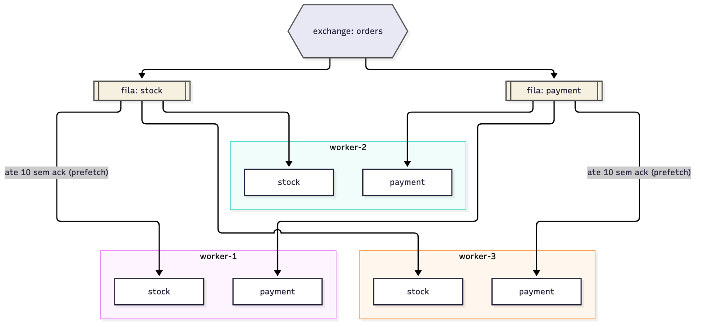

# message-queue-ecommerce
## Etapa 2: Arquitetura da Solução

**Trabalho Prático de Mensageria** · Sistemas Distribuídos · FURB
Prof. Gabriel Castellani · Entrega: 17/09/2026

---

## 1. Componentes

São dois processos Go (`api` e `worker`), o **RabbitMQ** e o **PostgreSQL**. Nenhum
componente chama outro diretamente: tudo que acontece depois do checkout passa pelo
broker.

O carrinho é HTTP comum (`POST /carts` e `POST /carts/{id}/items` só gravam no banco).
A mensageria começa no checkout, e a ordem é sempre **reservar o estoque antes de
cobrar**.


### 1.1 Produtores e consumidores

| Componente | Consome (fila) | Publica |
|---|---|---|
| `api` | nada | `order.placed`, no checkout |
| `stock` (no `worker`) | `order.placed`, `payment.declined`, `reservation.expired` | `reservation.created` ou `reservation.rejected`, e `reservation.expired` no exchange `expiry` |
| `payment` (no `worker`) | `reservation.created` | `payment.approved` ou `payment.declined` |
| `notification` (no `worker`) | todos os eventos (`#`) | nada; só registra uma linha de log por evento |

`stock` e `payment` consomem um fato e publicam o fato seguinte. É assim que o fluxo
anda sem que um componente conheça o próximo.

Cada handler grava no banco o status que o **seu** trabalho produz, na mesma transação
do efeito. O `notification` não grava status: ele recebe tudo, sem ordem garantida, e
por isso não pode ser o dono do estado.

O gateway de pagamento é simulado: o `payment` recusa ~15 % das cobranças ao acaso, e a
variável `FAIL_RATE` (0 a 1) simula o gateway fora do ar para demonstrar a retentativa.
A interface web (`web/`) só observa: lê os contadores da Management API com um usuário
sem permissão de escrita.

---

## 2. Fluxo de mensagens

### 2.1 Tipos de mensagem

São seis eventos, com nomes no passado (`<agregado>.<fato>`), porque cada mensagem conta
algo que **já aconteceu**. A *routing key* é igual ao campo `type`.

| Routing key | Publicado por | Consumido por |
|---|---|---|
| `order.placed` | `api` | `stock`, `notification` |
| `reservation.created` | `stock` | `payment`, `notification` |
| `reservation.rejected` | `stock` | `notification` |
| `payment.approved` | `payment` | `notification` |
| `payment.declined` | `payment` | `stock`, `notification` |
| `reservation.expired` | `stock`, 120 s depois (via `expiry.q`) | `stock`, `notification` |

Todas usam o mesmo envelope JSON:

```json
{
  "id": "550e8400-e29b-41d4-a716-446655440000",
  "type": "payment.approved",
  "order_id": "3a7b1e90-1234-4abc-8def-0123456789ab",
  "data": { "transaction_id": "TX-88213", "amount_cents": 24990 }
}
```

O `id` é a chave de idempotência, que permite ao consumidor reconhecer uma reentrega.
Data e *content-type* vão nas propriedades AMQP, não no corpo.

### 2.2 Exchanges, filas e bindings

São quatro exchanges `topic` duráveis: `orders` (barramento principal), `retry`
(mensagens que falharam), `dlx` (mensagens que esgotaram as tentativas) e `expiry`
(prazo das reservas).

| Fila | Exchange | Binding keys | Política |
|---|---|---|---|
| `stock` | `orders` | `order.placed`, `payment.declined`, `reservation.expired` | falha vai para `retry` |
| `payment` | `orders` | `reservation.created` | falha vai para `retry` |
| `notification` | `orders` | `#` | falha vai para `retry` |
| `retry.q` | `retry` | `#` | espera 10 s e volta ao `orders` |
| `expiry.q` | `expiry` | `#` | espera 120 s e volta ao `orders` |
| `dlq` | `dlx` | `#` | nenhuma; fica para inspeção |

O *binding* `#` do `notification` faz o **fan-out**: o mesmo evento chega a mais de uma
fila, e cada consumidor faz uma coisa diferente sem saber dos outros. A `retry.q` e a
`expiry.q` não têm consumidor; servem só como temporizadores. A configuração completa
está na Etapa 3.

### 2.3 Fluxo de um pedido pago


O `201` sai antes de qualquer processamento, e a cobrança só começa com o estoque já
reservado.

### 2.4 Estados do pedido


O carrinho é um pedido em status `CART`; não existe tabela separada de carrinho.

| Transição | Quem grava | Gatilho |
|---|---|---|
| `CART → PLACED` | `api` | checkout |
| `PLACED → RESERVED` | `stock` | `order.placed` com estoque |
| `PLACED → OUT_OF_STOCK` | `stock` | `order.placed` sem estoque |
| `RESERVED → PAID` | `payment` | cobrança aprovada |
| `RESERVED → DECLINED` | `stock` | `payment.declined` (devolve o estoque) |
| `RESERVED → EXPIRED` | `stock` | `reservation.expired` (devolve o estoque) |

Toda transição é um *compare-and-set*: o handler trava a linha do pedido
(`SELECT ... FOR UPDATE`), confere se o status é o anterior esperado e só então
atualiza. Se o status já for outro, outro evento chegou antes, e o handler só confirma
a mensagem.

Travamos a linha, em vez de usar um único `UPDATE ... WHERE status = $anterior`, porque
o checkout publica `order.placed` antes do seu `COMMIT` (§4). O `UPDATE` condicional
não espera transações abertas: veria o status antigo e perderia o evento. O
`FOR UPDATE` espera o checkout terminar.

### 2.5 Ciclo da reserva


Ao reservar, o `stock` subtrai as unidades de `available` e publica
`reservation.expired` no exchange `expiry`. A mensagem espera 120 s na `expiry.q` e
volta ao `orders`. Três eventos disputam a reserva, e o primeiro a trocar o status
`RESERVED` vence:

- pagamento aprovado → `PAID`;
- pagamento recusado → `DECLINED`, e as unidades voltam ao estoque;
- prazo vencido → `EXPIRED`, e as unidades voltam ao estoque.

Quem chega depois encontra outro status e não faz nada.

---

## 3. Escalabilidade

**Consumidores concorrentes.** Várias instâncias do `worker` consomem da mesma fila, e
o broker entrega cada mensagem a uma só delas. Basta
`docker compose up --scale worker=3`; o produtor não muda nada. No caso 10 da Etapa 4,
30 pedidos com 3 réplicas foram divididos em 11, 8 e 11.



Os três handlers rodam no mesmo processo, então escalamos o `worker` inteiro. O broker
permitiria escalar cada fila separadamente, mas isso exigiria processos separados por
fila, o que não fizemos (§6).

**Prefetch 10.** Sem limite, o broker entrega o máximo possível ao primeiro consumidor
e os outros ficam parados. Com `prefetch = 10`, cada consumidor segura no máximo 10
mensagens sem *ack*, e o trabalho se distribui.

**Pool de conexões.** Cada processo usa no máximo 20 conexões com o PostgreSQL. Numa
rajada as requisições esperam por uma conexão livre em vez de estourar o limite do
banco (100), que é compartilhado entre a `api` e as réplicas.

**Concorrência.** Escalar cria disputa real, e cada risco tem uma proteção:

| Risco | Proteção |
|---|---|
| Dois pedidos levam a última unidade | Um único `UPDATE products SET available = available - $1 WHERE id = $2 AND available >= $1`. Se nenhuma linha muda, falta estoque. `CHECK (available >= 0)` é a última barreira |
| A reserva expira e depois o pagamento aprova | `PAID` e `EXPIRED` exigem ambos o status `RESERVED`; só um vence. Se o `payment` perde, o estorno é simulado |
| Eventos do mesmo pedido chegam fora de ordem | O mesmo *compare-and-set* descarta o evento atrasado |

**Limite.** O broker roda em um nó só e é o ponto único de falha. Um cluster com filas
*quorum* resolveria, mas está fora do escopo.

---

## 4. Confiabilidade

O objetivo é não perder mensagem em nenhum ponto do caminho.

| Mecanismo | Falha que evita | Como |
|---|---|---|
| *Publisher confirms* | O produtor achar que publicou sem o broker ter recebido | Canal em modo `confirm`. A `api` só responde `201` depois do *ack* do broker |
| Publicar antes do `COMMIT` | Gravar a mudança no banco e não conseguir publicar o próximo evento | `api`, `stock` e `payment` publicam dentro da transação e esperam o *confirm*. Se a publicação falha, tudo é desfeito e a mensagem de entrada é tentada de novo |
| Durabilidade | Perder mensagens num reinício do broker | Filas `durable` e mensagens persistentes (`delivery_mode: 2`) |
| *Ack* manual | O consumidor morrer no meio do trabalho | Processa, grava no banco e só então confirma. Nunca usamos `autoAck` |
| Idempotência | Repetir o efeito numa reentrega | `INSERT INTO processed_messages (id) ... ON CONFLICT DO NOTHING` na mesma transação do efeito |

Publicamos antes do `COMMIT`, e não depois, por um motivo concreto. Se o handler
gravasse primeiro e a publicação falhasse, a mensagem voltaria, mas seria vista como
repetida, e o evento seguinte nunca sairia: o pedido ficaria `RESERVED` para sempre.
Publicando antes, o pior caso é sair um evento de uma mudança que não foi gravada. O
consumidor seguinte encontra o status antigo e ignora o evento. Evento a mais não causa
dano; evento a menos causa. No caso 15 da Etapa 4, matamos o `worker` com `kill -9` no
meio de 200 pedidos e o estoque fechou certo.

Com *ack* manual a entrega é *at-least-once*, então a mesma mensagem pode chegar duas
vezes. `stock` e `payment` deduplicam pelo `id`. O `notification` não deduplica, porque
uma linha de log repetida não tem efeito.

---

## 5. Tolerância a falhas

| Tipo de falha | Exemplo | Tratamento |
|---|---|---|
| Transitória | gateway fora do ar, timeout | até 3 tentativas, com 10 s entre elas |
| Permanente | JSON inválido, `id` ou `order_id` que não é UUID, tipo de mensagem inesperado | direto para a DLQ, sem retentativa |

Um produto inexistente nem chega ao broker: a `api` responde `404` ao adicionar o item.


**Retentativa sem código de espera.** O RabbitMQ não tem retentativa com atraso, mas dá
para montá-la com TTL e *dead-lettering*. Quando o handler falha, a mensagem é rejeitada
e a fila a manda para o exchange `retry`. Ela espera 10 s na `retry.q` e volta ao
`orders` com a mesma *routing key*.

Como a volta passa pelo `orders`, a mensagem chega de novo a **todas** as filas ligadas
àquela chave, e não só à que falhou. Um `reservation.created` que falhou no `payment`
também aparece de novo no `notification`. Isso é seguro porque `stock` e `payment` são
idempotentes e o `notification` só registra log. Uma fila de retentativa por fila de
negócio evitaria isso, ao custo de triplicar a `retry.q` e suas políticas.

**DLQ.** O broker registra cada rejeição no cabeçalho `x-death`. O handler lê quantas
vezes a mensagem já foi rejeitada na própria fila; se a terceira tentativa também
falhar, publica a mensagem original no `dlx` (com *confirm*) e só depois confirma a
original. A DLQ isola a mensagem com defeito, para que ela não trave a fila, e guarda o
histórico de tentativas para alguém analisar.


**Expiração da reserva.** Usa o mesmo mecanismo com 120 s: ninguém consome a
`expiry.q`, e a mensagem volta ao `orders` quando o prazo vence. Não há *cron* nem
temporizador no código, e o prazo sobrevive à queda do `worker` porque a mensagem está
no broker. Um pagamento que foi parar na DLQ não prende o estoque, porque a reserva
expira sozinha.

**Reconexão e encerramento.** Se a conexão com o broker cai, o processo reconecta com
espera crescente (1 s, 2 s, 4 s, até 30 s). Ao receber `SIGTERM`, o `worker` termina a
mensagem que está processando, confirma e só então encerra.

---

## 6. Decisões e alternativas

| Decisão | Alternativa descartada | Motivo |
|---|---|---|
| Exchange `topic` | `direct` ou `fanout` | O `notification` precisa de tudo (`#`) e o `payment` só de `reservation.created`. `direct` não aceita curinga; `fanout` mandaria tudo para todos |
| Um binário, vários contêineres | Um serviço por domínio | Não há necessidade de implantar separado. Cada handler tem sua fila e sua responsabilidade; só o processo é compartilhado |
| Retentativa com TTL e *dead-lettering* | `Nack` com *requeue* | O *requeue* imediato vira um laço de falhas sem espera |
| Um nível de 10 s | *Backoff* em vários níveis | Exigiria uma fila por nível para demonstrar o mesmo mecanismo |
| Contar tentativas pelo `x-death` | Coluna no banco | O broker já conta; uma segunda fonte poderia divergir |
| Filas clássicas duráveis | Filas *quorum* | Com um nó só, *quorum* não acrescenta nada |
| Reservar antes de cobrar, com prazo | Cobrar antes de reservar | Evita cobrar por produto que acabou; o prazo evita estoque preso |
| Carrinho como pedido em `CART` | Tabela de carrinho | Evita copiar itens no checkout e manter duas fontes de dados |
| Status gravado por quem causa a transição | Status gravado pelo `notification` | Pagamento e expiração disputam o mesmo pedido; só o *compare-and-set* na transação do efeito garante um vencedor |
| Publicar antes do `COMMIT` | Publicar depois, ou padrão *Outbox* | Depois do `COMMIT` o evento pode se perder; o *Outbox* resolveria com uma tabela e um processo a mais |
| Topologia no `definitions.json` | Declarar no código | Uma fonte só, e os usuários da aplicação não precisam de permissão para criar filas |
| *At-least-once* com idempotência | *Exactly-once* | *Exactly-once* não é garantido em sistema distribuído; esta combinação tem o mesmo efeito prático |
| Estado no PostgreSQL | Estado em memória | Com várias réplicas, a memória de cada uma teria uma parte diferente do estado |
