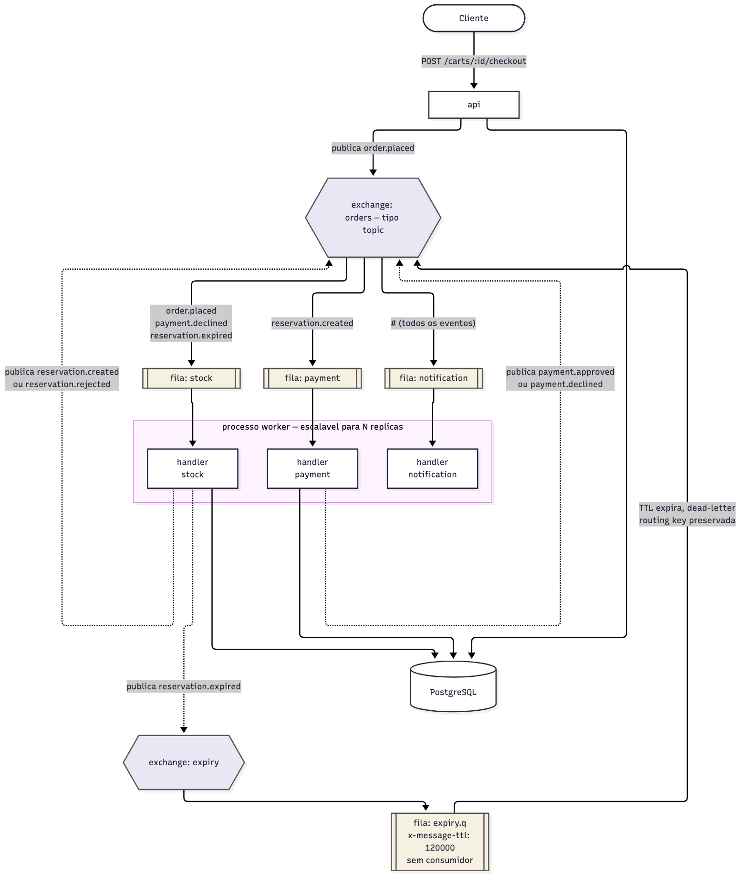
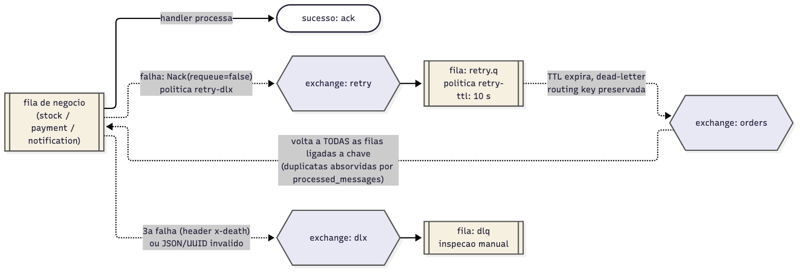
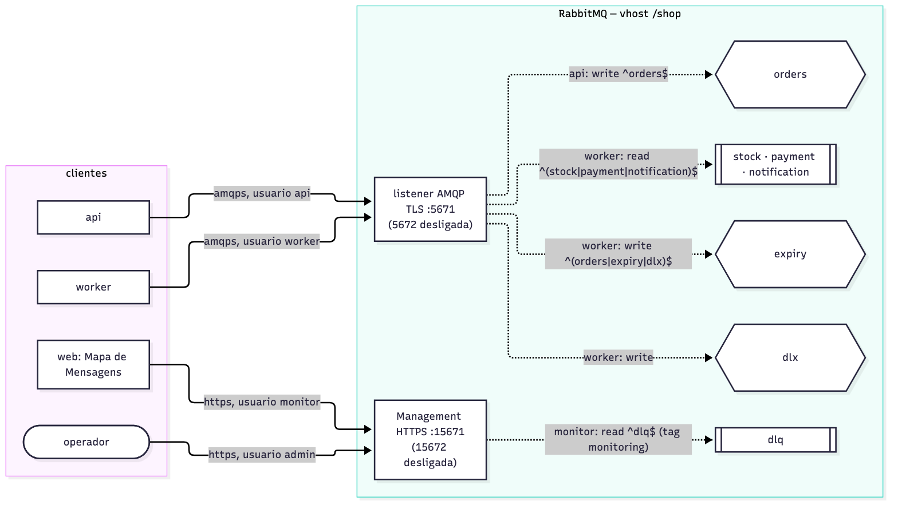

# message-queue-ecommerce
## Etapa 3: Configuração do RabbitMQ

**Trabalho Prático de Mensageria** · Sistemas Distribuídos · FURB
Prof. Gabriel Castellani

---

## 1. Visão geral

| Item | Valor |
|---|---|
| Imagem | `rabbitmq:3.13-management` |
| Nós | 1, sem cluster |
| Virtual host | `/shop` |
| Exchanges | 4, todos `topic` e duráveis |
| Filas | 6, clássicas e duráveis |
| Políticas | 3 (`retry-dlx`, `retry-ttl`, `expiry-ttl`) |
| Portas | só TLS: `5671` (AMQP) e `15671` (Management HTTPS), abertas apenas em `127.0.0.1` |
| Usuários | `api`, `worker`, `monitor` e `admin`; o `guest` não existe |

A configuração fica em `deploy/`:

| Arquivo | Conteúdo | No git |
|---|---|---|
| `rabbitmq.conf` | listeners TLS, certificados e carga das definições | sim |
| `definitions.tmpl.json` | usuários, permissões, políticas, exchanges, filas e bindings, com as senhas como marcadores | sim |
| `definitions.json` | o mesmo arquivo com as senhas reais, gerado pelo `setup.sh` | não |

O broker carrega a topologia sozinho ao iniciar (`load_definitions`); a aplicação não
declara filas. Com isso há uma fonte única da topologia, um `order.placed` publicado
com o `worker` parado já encontra a fila `stock`, e os usuários da aplicação não
precisam de permissão para criar nada (§7).

No código ficam só dois valores: `prefetch = 10` (mensagens sem *ack* por consumidor)
e `maxAttempts = 3` (entregas por fila antes da DLQ), em `internal/mq/mq.go`.



## 2. Exchanges

| Exchange | Papel |
|---|---|
| `orders` | barramento principal; todo evento de negócio é publicado aqui |
| `retry` | recebe as mensagens rejeitadas pelas filas de negócio |
| `dlx` | recebe as mensagens que esgotaram as tentativas ou são inválidas |
| `expiry` | recebe o `reservation.expired` publicado junto com a reserva |

Todos são `topic` e duráveis. O `topic` permite usar o curinga `#`, que o
`notification` e as filas técnicas usam para receber tudo.

## 3. Filas e políticas

As filas são criadas sem argumentos. O TTL e o destino das mensagens rejeitadas vêm de
**políticas**, que o broker aplica pelo nome da fila:

| Política | Filas | Definição |
|---|---|---|
| `retry-dlx` | `stock`, `payment`, `notification` | `dead-letter-exchange: retry` |
| `retry-ttl` | `retry.q` | `message-ttl: 10000`, `dead-letter-exchange: orders` |
| `expiry-ttl` | `expiry.q` | `message-ttl: 120000`, `dead-letter-exchange: orders` |

| Fila | Consumidor | Função |
|---|---|---|
| `stock`, `payment`, `notification` | `worker` | filas de negócio; uma falha vai para o `retry` |
| `retry.q` | nenhum | segura a mensagem 10 s e a devolve ao `orders` |
| `expiry.q` | nenhum | segura o `reservation.expired` 120 s e o devolve ao `orders` |
| `dlq` | nenhum | guarda as mensagens com falha para inspeção |

A `retry.q` e a `expiry.q` funcionam como temporizadores: quando o TTL vence, a
mensagem volta ao `orders` com a *routing key* original, porque nenhuma política troca
a chave.

**Por que políticas e não argumentos na fila.** Um argumento como `x-message-ttl` fica
gravado na fila: para mudar o valor é preciso apagar e recriar a fila, perdendo as
mensagens, e quem declarar a fila com outro valor recebe `PRECONDITION_FAILED`. Uma
política pode ser alterada com o broker no ar (`rabbitmqctl set_policy`), sem mexer no
código. É também o que a documentação do RabbitMQ recomenda para TTL e DLX.

## 4. Bindings

| Origem | Binding key | Destino |
|---|---|---|
| `orders` | `order.placed` | `stock` |
| `orders` | `payment.declined` | `stock` |
| `orders` | `reservation.expired` | `stock` |
| `orders` | `reservation.created` | `payment` |
| `orders` | `#` | `notification` |
| `retry` | `#` | `retry.q` |
| `expiry` | `#` | `expiry.q` |
| `dlx` | `#` | `dlq` |

Um `reservation.created`, por exemplo, chega ao `payment` e ao `notification` com o
mesmo `id`. Para um novo interessado receber eventos, basta criar uma fila e um
binding; o produtor não muda.

## 5. Publicação

Toda publicação passa por `mq.Publish` (`internal/mq/publish.go`):

| Propriedade | Valor | Motivo |
|---|---|---|
| *routing key* | o `type` do envelope | o exchange roteia por ela |
| `delivery_mode` | `2` (persistente) | a mensagem vai para o disco e sobrevive a reinícios |
| `content_type` | `application/json` | o corpo é o envelope JSON |
| `message_id` | o `id` do envelope | a mesma chave usada na idempotência |
| `timestamp` | hora da publicação | rastreio |
| `mandatory` | `false` | toda *routing key* publicada tem fila ligada (limitação na Etapa 5) |

**Publisher confirms.** Todo canal é aberto em modo `confirm`. A publicação só conta
como feita quando o broker responde `ack`; `nack` ou 5 s sem resposta são tratados
como erro. Uma mensagem persistente só é garantia se o produtor souber que o broker a
recebeu.

**Checkout.** A `api` publica o `order.placed` dentro da transação que muda o pedido de
`CART` para `PLACED`. Sem confirmação do broker a transação é desfeita, o pedido
continua `CART` e a resposta é `503`, que o cliente pode repetir. `stock` e `payment`
seguem a mesma regra (Etapa 2, §4).

## 6. Consumo, retentativa e DLQ

| Regra | Configuração | Motivo |
|---|---|---|
| *Ack* manual | `autoAck=false`; *ack* só depois do handler | se o `worker` cair no meio, a mensagem volta para a fila |
| Prefetch | `Qos(10, 0, false)` | limita mensagens sem *ack* por consumidor e distribui a carga |
| Um canal por fila | cada fila consome e publica no próprio canal | canais AMQP não podem ser usados em paralelo |
| Mensagem inválida | JSON inválido ou `id`/`order_id` que não é UUID vai direto ao `dlx` | tentar de novo não conserta o corpo |
| Reconexão | espera de 1 s, dobrando até 30 s | o broker pode reiniciar e o `worker` volta sozinho |
| Parada graciosa | no `SIGTERM`, termina a mensagem atual antes de sair | o desligamento não corta uma transação ao meio |



**Ciclo de retentativa.**

1. O handler falha e o `worker` rejeita a mensagem sem *requeue* (`Nack(false, false)`).
2. A política `retry-dlx` manda a mensagem para o exchange `retry`, que a entrega na
   `retry.q`.
3. Depois de 10 s, a `retry.q` devolve a mensagem ao `orders` com a mesma *routing key*.
4. A mensagem chega de novo às filas ligadas àquela chave.

**Contagem.** São **3 tentativas no total**, não 3 retentativas. A cada rejeição o
broker atualiza o cabeçalho `x-death`. O `worker` conta só a entrada da própria fila
com `reason: rejected`; as entradas `retry.q`/`expired` de cada espera são ignoradas.
Na terceira falha a mensagem é publicada no `dlx` com *confirm* e só então recebe *ack*.
Se essa publicação falhar, a mensagem volta para a retentativa em vez de se perder.

Como a volta passa pelo `orders`, uma falha no `payment` também faz o `notification`
receber o evento de novo. Isso não causa efeito duplicado: os handlers que gravam no
banco são idempotentes (Etapa 2, §5).

**`FAIL_RATE`.** Variável do `worker` (padrão `0`) que simula o gateway fora do ar. Só
afeta o `payment`, antes de qualquer gravação, e serve para demonstrar retentativa e
DLQ: `FAIL_RATE=1 docker compose up -d worker`.

## 7. Autenticação e autorização

### 7.1 Usuários e senhas

| Usuário | Tag | Usado por |
|---|---|---|
| `api` | nenhuma | processo `api` |
| `worker` | nenhuma | processo `worker` |
| `monitor` | `monitoring` | interface web (`web/`), só leitura |
| `admin` | `administrator` | pessoas: Management UI e inspeção da DLQ |

O `deploy/setup.sh` gera uma senha aleatória de 128 bits para cada usuário
(`openssl rand -hex 16`) e grava em `deploy/.env`. O Compose lê esse arquivo e monta as
URLs de conexão. Nenhuma senha vai para o repositório: `.env`, `definitions.json`,
`certs/` e `web/.env.local` estão no `.gitignore`. Como cada componente tem a própria
credencial, vazar uma não dá acesso ao que os outros fazem. O `guest` não existe,
porque o RabbitMQ não o cria quando as definições são importadas na inicialização.

### 7.2 Permissões

| Usuário | `configure` | `write` | `read` |
|---|---|---|---|
| `api` | `^$` | `^orders$` | `^$` |
| `worker` | `^$` | `^(orders\|expiry\|dlx)$` | `^(stock\|payment\|notification)$` |
| `monitor` | `^$` | `^$` | `^dlq$` |
| `admin` | `.*` | `.*` | `.*` |

Cada usuário tem só o necessário:

- Ninguém da aplicação tem `configure`, porque a topologia vem do `definitions.json`.
- A `api` só publica no `orders`.
- O `worker` lê das três filas de negócio e publica no `orders`, no `expiry` e no
  `dlx`. Não precisa escrever no `retry`: quem faz o *dead-lettering* é o próprio
  broker.
- O `monitor` vê as estatísticas e lê a `dlq` para a interface mostrar as mensagens com
  falha. Não publica nem apaga nada.
- O `admin` tem acesso total e é usado só por pessoas.

Testamos isso no caso 17 da Etapa 4: `api` e `worker` recebem `ACCESS_REFUSED` ao
publicar fora do permitido, o `monitor` não consegue publicar nem esvaziar fila, e
`guest` e `api` recebem `401` na Management UI.



## 8. Criptografia (TLS)

O TLS está ligado e é o único caminho: o AMQP sem criptografia foi desligado
(`listeners.tcp = none`) e a Management UI só responde em HTTPS.

**Certificados.** O `setup.sh` cria uma CA própria e um certificado do servidor
assinado por ela, válido para os dois nomes usados para acessar o broker: `rabbitmq`,
dentro do Compose, e `localhost`, no computador. Os nomes vão no *Subject Alternative
Name*, porque o cliente Go rejeita certificados que só trazem o nome no `CN`.

**Servidor** (`deploy/rabbitmq.conf`, resumido):

```ini
listeners.tcp = none
listeners.ssl.default = 5671
ssl_options.cacertfile = /etc/rabbitmq/certs/ca.pem
ssl_options.certfile = /etc/rabbitmq/certs/server.pem
ssl_options.keyfile = /etc/rabbitmq/certs/server.key
ssl_options.verify = verify_peer
ssl_options.fail_if_no_peer_cert = false
ssl_options.versions.1 = tlsv1.3
ssl_options.versions.2 = tlsv1.2
management.ssl.port = 15671
```

- Só TLS 1.3 e 1.2 são aceitos.
- O cliente não precisa de certificado próprio; ele se autentica com usuário e senha,
  que já trafegam cifrados.
- As portas `5672` e `15672` não existem, e as portas TLS só aceitam conexões do
  próprio computador.

**Clientes.**

| Cliente | Como confia na CA | Conexão |
|---|---|---|
| `api` e `worker` (Go) | variável `SSL_CERT_FILE=/certs/ca.pem`, lida pela biblioteca padrão do Go | `amqps://…@rabbitmq:5671/%2Fshop` |
| Interface web (Node) | `NODE_EXTRA_CA_CERTS=../deploy/certs/ca.pem` | `https://localhost:15671` |
| Operador | `curl --cacert deploy/certs/ca.pem`; o navegador avisa sobre a CA própria | `https://localhost:15671` |

No caso 17 da Etapa 4, o `openssl s_client` negociou `TLSv1.3` com
`TLS_AES_256_GCM_SHA384` e validou o certificado (`Verify return code: 0`) nas duas
portas.

## 9. Limitações

| Limitação | Impacto | Como resolver |
|---|---|---|
| Sem mTLS | clientes se autenticam por senha, não por certificado | `fail_if_no_peer_cert = true` e um certificado por cliente |
| PostgreSQL sem TLS | o tráfego com o banco não é cifrado, mas fica na rede do Compose e no próprio computador (porta `5432` só em `127.0.0.1`) | `sslmode=verify-full` se o banco sair dessa rede |
| Um nó, filas clássicas | o broker é ponto único de falha | cluster de 3 nós com filas *quorum* |
| `dlq` sem limite | mensagens com falha acumulam até alguém olhar | política com `max-length` e um alerta |
| Um nível de retentativa | sempre 10 s de espera | filas com TTL crescente, se falhas longas forem comuns |
