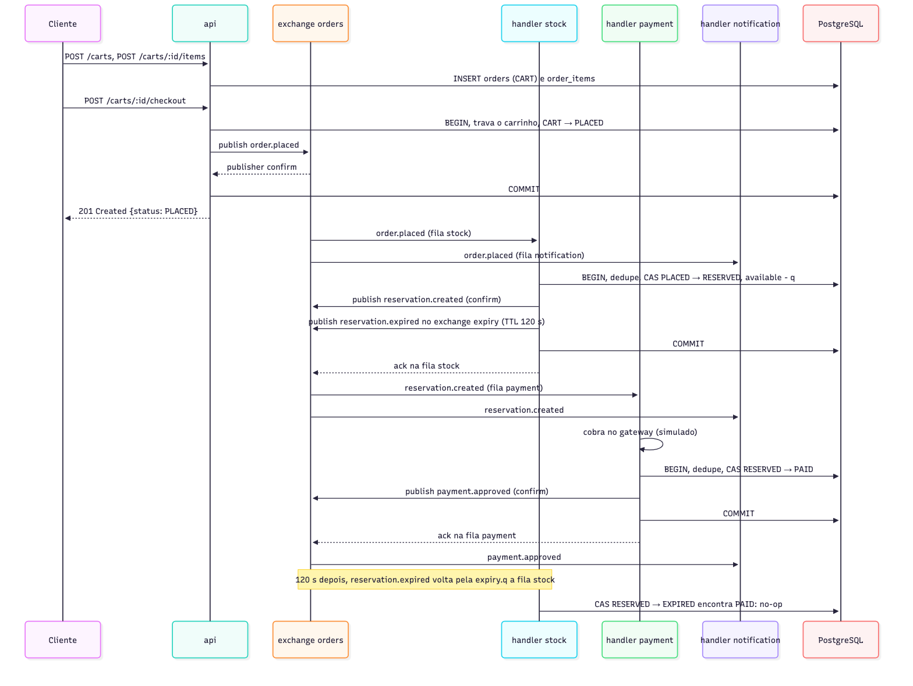
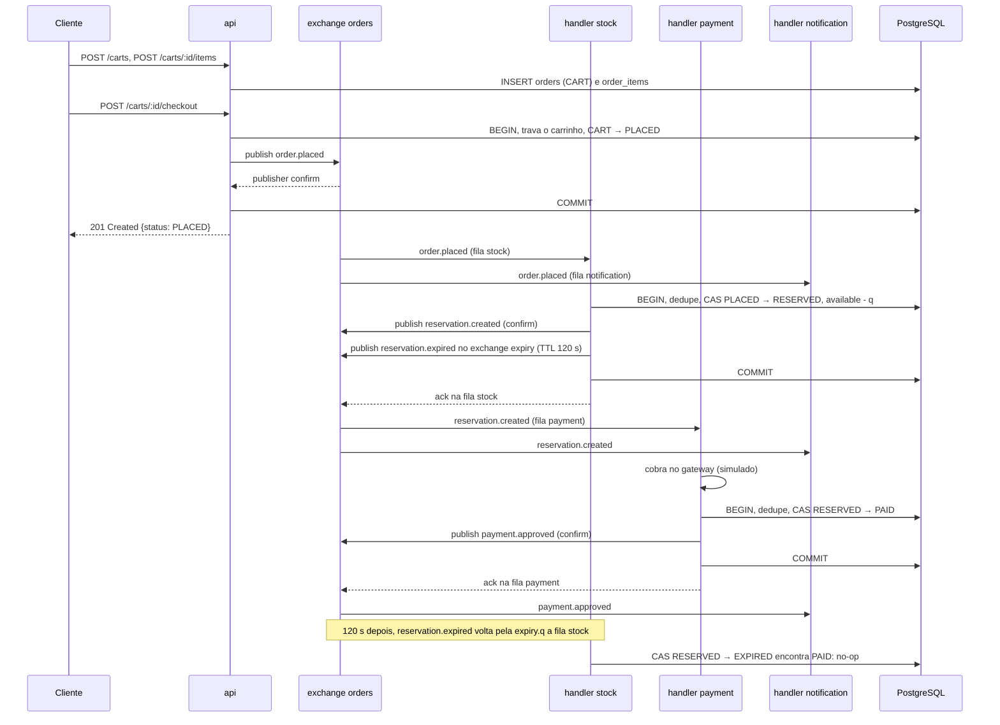
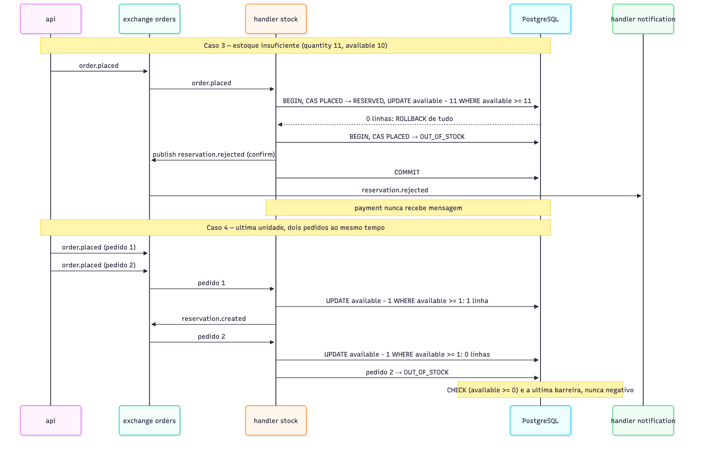
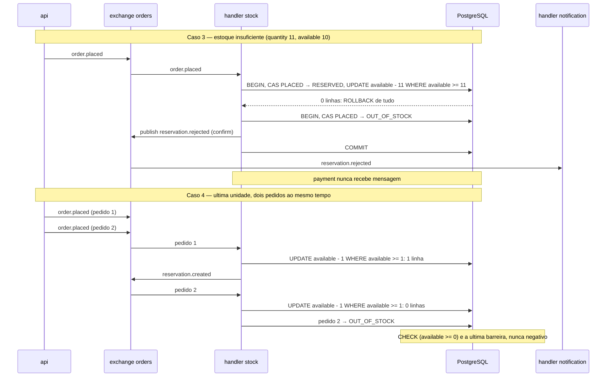
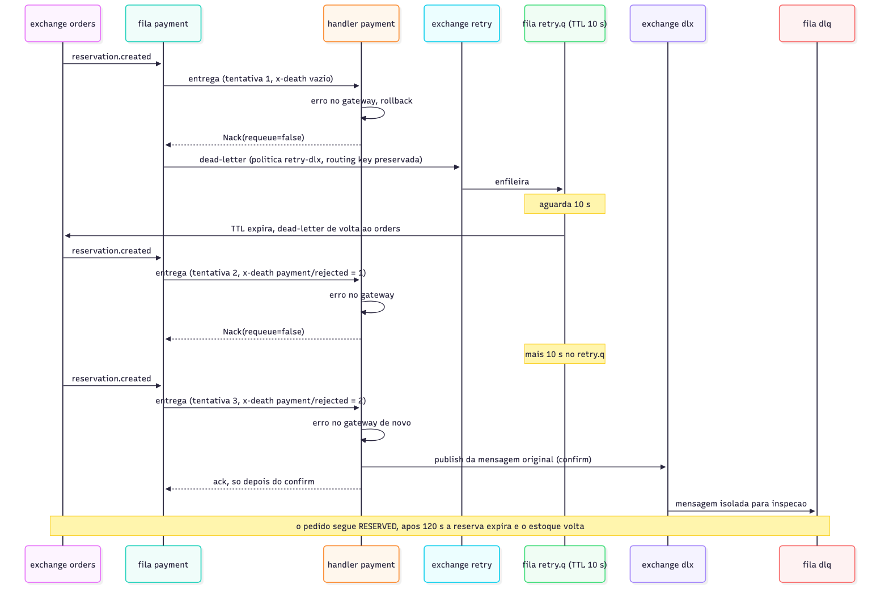
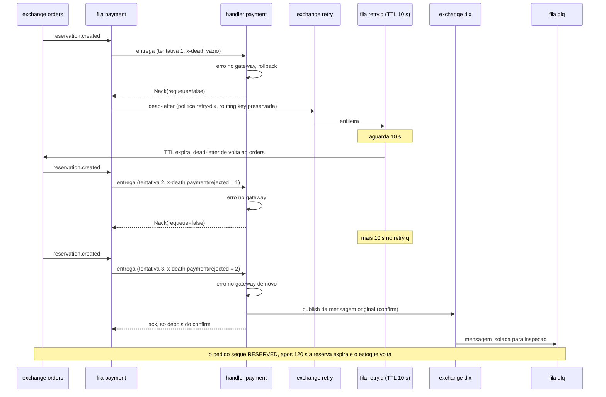
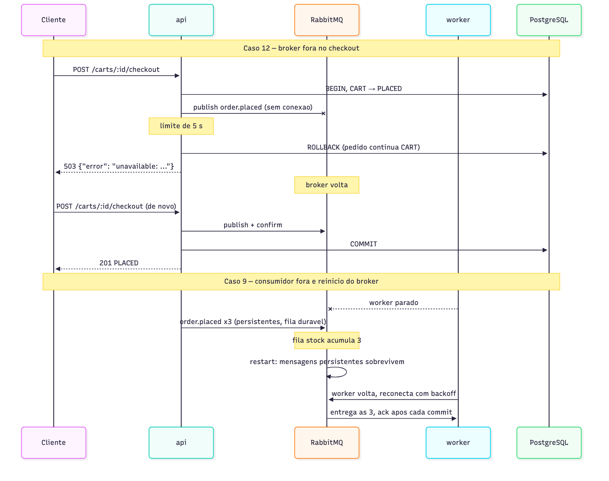
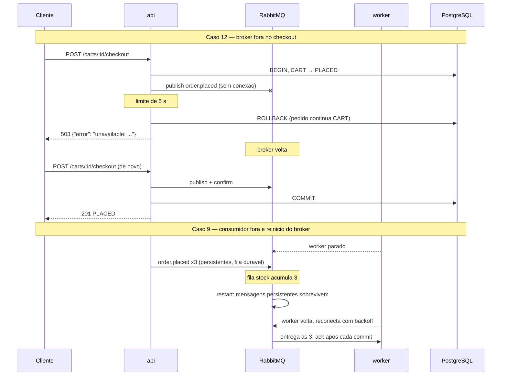

# message-queue-ecommerce
## Etapa 4 — Casos de Uso

**Trabalho Prático — Mensageria** · Sistemas Distribuídos · FURB
Prof. Gabriel Castellani · Entrega: 24/09/2026

---

## Ambiente

| Item | Valor |
|---|---|
| Máquina | macOS 26.6.2, `arm64` |
| Docker | 29.4.2, Docker Compose v5.1.3 |
| Commit | `a495477` (casos 1 a 14, 16, 17) · `e4e1e5a` (caso 15, com o limite do pool de conexões) |
| Execução | 01/10/2026, 18:15–18:23 UTC, em sequência, com `caffeinate` (a suspensão do macOS congela os TTLs do RabbitMQ) |
| Broker | TLS em `5671`/`15671`, usuários e senhas gerados por `setup.sh` (Etapa 3) |

A execução começa do zero (`docker compose down -v`, `sh setup.sh`,
`docker compose up -d --build`). Comandos executados a partir de `deploy/`,
com as funções auxiliares:

```sh
. ./.env
sql()   { docker compose exec -T postgres psql -U shop -d shop -tAc "$1"; }
mq()    { curl -s --cacert certs/ca.pem -u admin:$ADMIN_PASS "https://localhost:15671/api/$1" "${@:2}"; }
P=$(sql "SELECT id FROM products WHERE name='Keyboard'")
order() { C=$(curl -s -X POST localhost:8080/carts | jq -r .id)
  curl -s -X POST localhost:8080/carts/$C/items -d "{\"product_id\":\"$P\",\"quantity\":${1:-1}}" >/dev/null
  curl -s -X POST localhost:8080/carts/$C/checkout; echo; }
st()    { curl -s localhost:8080/orders/$1 | jq -r .status; }
stock() { sql "UPDATE products SET available=$1 WHERE id='$P'"; }
avail() { sql "SELECT available FROM products WHERE id='$P'"; }
pub()   { mq exchanges/%2Fshop/orders/publish -X POST -H 'content-type: application/json' \
  -d "$(jq -nc --arg k "$1" --arg p "$2" '{properties:{delivery_mode:2,content_type:"application/json"},routing_key:$k,payload:$p,payload_encoding:"string"}')"; echo; }
```

`pub` publica no exchange `orders` pela Management API com o usuário `admin`
— é o operador simulando um produtor, para os casos de reentrega e mensagem
inválida. As saídas abaixo são reais, recortadas nas linhas relevantes; UUIDs
longos foram abreviados com `…` depois da primeira ocorrência.

## Mapa dos casos

| Caso | O que demonstra | Exchanges / filas envolvidas | Diagrama |
|---|---|---|---|
| 1 | Fluxo feliz, checkout sem esperar o processamento | `orders` → `stock`, `payment`, `notification`; `expiry` → `expiry.q` | [sequencia-feliz](diagramas/sequencia-feliz.png) |
| 2 | Pagamento recusado devolve o estoque | `orders` → `payment`, `stock` | [reserva](diagramas/reserva.png) |
| 3 | Estoque insuficiente, sem cobrança | `orders` → `stock`, `notification` | [sequencia-estoque](diagramas/sequencia-estoque.png) |
| 4 | Última unidade disputada | `orders` → `stock` | [sequencia-estoque](diagramas/sequencia-estoque.png) |
| 5 | Expiração da reserva (120 s) | `expiry` → `expiry.q` → `orders` → `stock` | [reserva](diagramas/reserva.png) |
| 6 | Fan-out | `orders` → `payment` + `notification` | [arquitetura](diagramas/arquitetura.png) |
| 7 | Retentativa com espera de 10 s | `payment` → `retry` → `retry.q` → `orders` | [sequencia-falha](diagramas/sequencia-falha.png) |
| 8 | DLQ após 3 tentativas | `dlx` → `dlq` | [sequencia-falha](diagramas/sequencia-falha.png) |
| 9 | Consumidor fora e reinício do broker | `stock` (fila durável) | [sequencia-indisponivel](diagramas/sequencia-indisponivel.png) |
| 10 | Consumidores concorrentes | `stock`, `payment`, `notification` | [escala](diagramas/escala.png) |
| 11 | Idempotência | `orders` → `stock` | — |
| 12 | Broker fora no checkout | `orders` (indisponível) | [sequencia-indisponivel](diagramas/sequencia-indisponivel.png) |
| 13 | Erros de entrada HTTP | nenhum (barrado na `api`) | — |
| 14 | Mensagem inválida vai direto à DLQ | `orders` → `stock`/`notification` → `dlx` → `dlq` | [retentativa](diagramas/retentativa.png) |
| 15 | `worker` morto no meio do processamento | `stock`, `payment` | [sequencia-feliz](diagramas/sequencia-feliz.png) |
| 16 | Pagamento tardio e expiração de pedido pago | `orders` → `payment`, `stock` | [reserva](diagramas/reserva.png) |
| 17 | Segurança: TLS, usuários e permissões | listeners `5671`/`15671` | [seguranca](diagramas/seguranca.png) |

## Mensagens trocadas

Toda mensagem tem o mesmo envelope (Etapa 5, §2); só `payment.approved` leva
`data`. As mensagens do caso 1, com os ids reais:

| # | Exchange → routing key | Produtor | Filas que recebem | Corpo |
|---|---|---|---|---|
| 1 | `orders` → `order.placed` | `api` | `stock`, `notification` | `{"id":"5ee6dcd2-…","type":"order.placed","order_id":"d93c8d8e-…","data":{}}` |
| 2 | `orders` → `reservation.created` | `stock` | `payment`, `notification` | `{"id":"9750cde6-…","type":"reservation.created","order_id":"d93c8d8e-…","data":{}}` |
| 3 | `expiry` → `reservation.expired` | `stock` | `expiry.q` (120 s), depois `stock`, `notification` | `{"id":"532d24bb-…","type":"reservation.expired","order_id":"d93c8d8e-…","data":{}}` |
| 4 | `orders` → `payment.approved` | `payment` | `notification` | `{"id":"85108112-…","type":"payment.approved","order_id":"d93c8d8e-…","data":{"transaction_id":"TX-449a84f9","amount_cents":24990}}` |

Propriedades AMQP de todas: `delivery_mode: 2`, `content_type:
application/json`, `message_id` igual ao `id` do envelope, `timestamp` da
publicação (o caso 9 mostra as propriedades lidas da fila).

---

### Caso 1 — Fluxo feliz

- **Objetivo:** US1 (checkout imediato) e US3 (estoque e pagamento corretos).
- **Entrada:**
  ```sh
  stock 10
  C=$(curl -s -X POST localhost:8080/carts | jq -r .id)
  curl -s -w 'HTTP %{http_code}\n' -X POST localhost:8080/carts/$C/items -d "{\"product_id\":\"$P\",\"quantity\":1}"
  curl -s -w 'HTTP %{http_code} %{time_total}s\n' -X POST localhost:8080/carts/$C/checkout
  sleep 3; curl -s -w 'HTTP %{http_code}\n' localhost:8080/orders/$C; avail
  docker compose logs --no-log-prefix api worker | grep "order_id=$C"
  ```
  Tempo de resposta com o `worker` parado:
  ```sh
  docker compose stop worker
  C=$(curl -s -X POST localhost:8080/carts | jq -r .id)
  curl -s -X POST localhost:8080/carts/$C/items -d "{\"product_id\":\"$P\",\"quantity\":1}" >/dev/null
  curl -s -o /dev/null -w '%{http_code} %{time_total}\n' -X POST localhost:8080/carts/$C/checkout
  st $C; docker compose start worker; sleep 6; st $C
  ```
- **Processamento:**
  1. `api`: `POST /carts` cria o pedido em `CART`; `POST /carts/{id}/items` grava o item com o preço do momento.
  2. `api`: no checkout, numa transação, trava o carrinho, faz `CART → PLACED`, publica `order.placed` no `orders`, espera o *publisher confirm* e só então faz `COMMIT` e responde `201`.
  3. `stock` (fila `stock`): numa transação, registra o `id` em `processed_messages`, faz o *compare-and-set* `PLACED → RESERVED`, subtrai o estoque, publica `reservation.created` (`orders`) e `reservation.expired` (`expiry`), `COMMIT`, *ack*.
  4. `payment` (fila `payment`): cobra (simulado), `RESERVED → PAID`, publica `payment.approved`, `COMMIT`, *ack*.
  5. `notification` recebe os três eventos pelo binding `#` e registra cada um.
- **Saída esperada:** `201` com `status: PLACED`; depois `PAID` e `available` 9; checkout rápido mesmo sem `worker`.
- **Saída obtida:**
  ```
  POST /carts                    -> {"id":"d93c8d8e-e941-4958-bd36-364fa06fbebc","status":"CART"}  HTTP 201
  POST /carts/d93c8d8e-…/items   -> {"product_id":"5b8909f6-…","quantity":1,"price_cents":24990}   HTTP 201
  POST /carts/d93c8d8e-…/checkout -> {"id":"d93c8d8e-…","status":"PLACED"}                        HTTP 201 0.005342s
  GET  /orders/d93c8d8e-…        -> {"id":"d93c8d8e-…","items":[{"product_id":"5b8909f6-…","quantity":1,"price_cents":24990}],"status":"PAID","total_cents":24990}  HTTP 200
  available=9
  2026/10/01 18:19:43 api: order.placed id=5ee6dcd2-… order_id=d93c8d8e-…
  2026/10/01 18:19:43 queue=stock type=order.placed id=5ee6dcd2-… order_id=d93c8d8e-… attempt=1
  2026/10/01 18:19:43 queue=notification type=order.placed id=5ee6dcd2-… order_id=d93c8d8e-… attempt=1
  2026/10/01 18:19:43 stock: reserved order_id=d93c8d8e-…
  2026/10/01 18:19:43 queue=payment type=reservation.created id=9750cde6-… order_id=d93c8d8e-… attempt=1
  2026/10/01 18:19:43 payment: approved order_id=d93c8d8e-… transaction_id=TX-449a84f9 amount_cents=24990
  2026/10/01 18:19:43 notification: type=payment.approved id=85108112-… order_id=d93c8d8e-…

  201 0.005970          (worker parado)
  status (worker parado)=PLACED
  status (worker iniciado)=PAID
  ```
- **Resultado:** ok. Checkout em 5,3 ms (6,0 ms com o `worker` parado); o pedido ficou `PLACED` na fila e foi processado quando o `worker` voltou.

### Caso 2 — Pagamento recusado

- **Objetivo:** US3 (recusa devolve o estoque).
- **Entrada:**
  ```sh
  stock 100; for i in $(seq 20); do order 1 >/dev/null; done; sleep 8
  sql "SELECT status, count(*) FROM orders WHERE status IN ('PAID','DECLINED') GROUP BY 1 ORDER BY 1"
  D=$(sql "SELECT id FROM orders WHERE status='DECLINED' ORDER BY updated_at DESC LIMIT 1")
  docker compose logs --no-log-prefix worker | grep -E "payment: declined order_id=$D|stock: released order_id=$D"; avail
  ```
- **Processamento:** `payment` sorteia a recusa (~15 %) e publica `payment.declined` (sem gravar status); `stock` recebe pela fila `stock`, faz o *compare-and-set* `RESERVED → DECLINED` e devolve as unidades na mesma transação.
- **Saída esperada:** pedidos `DECLINED` com o estoque devolvido.
- **Saída obtida:**
  ```
  DECLINED|3
  PAID|18
  D=20bc6c73-a2bc-4ac2-8e22-73eafa0b35a8
  2026/10/01 18:15:23 payment: declined order_id=20bc6c73-…
  2026/10/01 18:15:23 stock: released order_id=20bc6c73-… status=DECLINED
  available=83
  ```
- **Resultado:** ok. A contagem inclui o pedido pago com o `worker` parado do caso 1; dos 20 deste caso, 17 foram pagos e 3 recusados, e `available = 100 − 17 = 83` confirma que as 3 unidades recusadas voltaram.

### Caso 3 — Estoque insuficiente

- **Objetivo:** US3 (sem estoque, sem cobrança).
- **Entrada:**
  ```sh
  stock 10; order 11; sleep 3; st $C
  docker compose logs worker | grep "order_id=$C" | grep -c queue=payment
  docker compose logs --no-log-prefix worker | grep "order_id=$C" | grep -E "stock:|notification:"; avail
  ```
- **Processamento:** a reserva falha no `UPDATE products SET available = available - 11 WHERE id = $2 AND available >= 11` (0 linhas); a transação inteira é desfeita. Numa nova transação, `PLACED → OUT_OF_STOCK` e publicação de `reservation.rejected`, que só o `notification` recebe.
- **Saída esperada:** `OUT_OF_STOCK`; `payment` nunca recebe mensagem; `available` intacto.
- **Saída obtida:**
  ```
  {"id":"bbeebb25-2662-497f-8e2d-db873d1bd41a","status":"PLACED"}
  status=OUT_OF_STOCK
  payment lines=0
  2026/10/01 18:15:32 notification: type=order.placed id=9bd25172-… order_id=bbeebb25-…
  2026/10/01 18:15:32 notification: type=reservation.rejected id=6c9e7590-… order_id=bbeebb25-…
  2026/10/01 18:15:32 stock: out_of_stock order_id=bbeebb25-…
  available=10
  ```
- **Resultado:** ok.

### Caso 4 — Última unidade, dois clientes

- **Objetivo:** US9 (sem venda acima do estoque).
- **Entrada:**
  ```sh
  stock 1
  C1=$(curl -s -X POST localhost:8080/carts | jq -r .id); C2=$(curl -s -X POST localhost:8080/carts | jq -r .id)
  for c in $C1 $C2; do curl -s -X POST localhost:8080/carts/$c/items -d "{\"product_id\":\"$P\",\"quantity\":1}" >/dev/null; done
  curl -s -XPOST localhost:8080/carts/$C1/checkout & curl -s -XPOST localhost:8080/carts/$C2/checkout & wait; sleep 4
  echo "C1=$(st $C1) C2=$(st $C2) available=$(avail)"
  docker compose logs --no-log-prefix worker | grep -E "stock: .*order_id=($C1|$C2)"
  ```
- **Processamento:** os dois `order.placed` são processados pelo `stock`; cada um trava o próprio pedido (`SELECT ... FOR UPDATE`) e tenta o `UPDATE ... AND available >= 1` na mesma linha de `products`. O PostgreSQL serializa os dois `UPDATE`: o primeiro afeta 1 linha, o segundo encontra `available = 0` e afeta 0. `CHECK (available >= 0)` é a última barreira.
- **Saída esperada:** um pedido reserva (e termina `PAID` ou `DECLINED`), o outro fica `OUT_OF_STOCK`; `available` nunca negativo.
- **Saída obtida:**
  ```
  {"id":"49a1de5e-683f-4a07-af53-1d5459bbccf0","status":"PLACED"}
  {"id":"b9f49e4b-1cbc-488d-ad66-3c5c2e70c309","status":"PLACED"}
  C1=OUT_OF_STOCK C2=PAID available=0
  2026/10/01 18:15:35 stock: reserved order_id=49a1de5e-…
  2026/10/01 18:15:35 stock: out_of_stock order_id=b9f49e4b-…
  ```
- **Resultado:** ok. Um vencedor (`PAID`), um `OUT_OF_STOCK`, `available = 0`. (Os ids das respostas saem na ordem em que os dois `curl` terminam, não na ordem `C1`, `C2`.)

### Caso 5 — Expiração da reserva

- **Objetivo:** US10 (reserva abandonada devolve o estoque).
- **Entrada:**
  ```sh
  FAIL_RATE=1 docker compose up -d worker; stock 10; order 1; sleep 2; st $C; avail
  # aguardar ≥ 125 s a partir do checkout
  st $C; avail
  docker compose logs --no-log-prefix worker | grep "order_id=$C" | grep -E "stock: (reserved|released)"
  ```
- **Processamento:** `stock` reserva e, na mesma transação, publica `reservation.expired` no exchange `expiry`; `expiry.q` o segura por 120 s (política `expiry-ttl`) e faz *dead-letter* para o `orders`; como o pagamento nunca aprova (casos 7 e 8), o `stock` encontra o pedido ainda `RESERVED`, faz `RESERVED → EXPIRED` e devolve a unidade.
- **Saída esperada:** pedido `RESERVED`; após 120 s, `EXPIRED` e estoque restaurado.
- **Saída obtida:**
  ```
  {"id":"921994ea-825a-4c22-9c97-65b9f0e3a301","status":"PLACED"}
  status=RESERVED available=9
  status=RESERVED (27 s após o checkout)
  status=EXPIRED available=10 (122 s após o checkout)
  2026/10/01 18:17:02 stock: reserved order_id=921994ea-…
  2026/10/01 18:19:02 stock: released order_id=921994ea-… status=EXPIRED
  ```
- **Resultado:** ok. Reserva às 18:17:02, liberação às 18:19:02 — exatamente 120 s.

### Caso 6 — Fan-out

- **Objetivo:** US4 (um evento, vários consumidores).
- **Entrada:** `docker compose logs --no-log-prefix worker | grep "type=reservation.created" | grep "order_id=$C" | grep "queue="` (pedido do caso 1)
- **Processamento:** `reservation.created` é publicado **uma vez** no `orders`; o binding `reservation.created` entrega em `payment` e o binding `#` entrega em `notification`.
- **Saída esperada:** a mesma mensagem (mesmo `id`) nas duas filas.
- **Saída obtida:**
  ```
  2026/10/01 18:19:43 queue=notification type=reservation.created id=9750cde6-209d-4a5d-b1cb-df423468ff21 order_id=d93c8d8e-… attempt=1
  2026/10/01 18:19:43 queue=payment type=reservation.created id=9750cde6-209d-4a5d-b1cb-df423468ff21 order_id=d93c8d8e-… attempt=1
  ```
- **Resultado:** ok.

### Caso 7 — Retentativa

- **Objetivo:** US5 (falha transitória é retentada).
- **Entrada:** mesma execução do caso 5 (`FAIL_RATE=1`); após ~25 s:
  ```sh
  docker compose logs --no-log-prefix worker | grep "order_id=$C" | grep -E "queue=payment type=reservation.created|payment: gateway error"
  docker compose logs --no-log-prefix worker | grep "queue=payment" | grep -E "failed, retry|-> dlq"
  ```
- **Processamento:** `payment` falha (erro simulado do gateway) → `Nack(requeue=false)` → a política `retry-dlx` faz *dead-letter* para o `retry` → `retry.q` segura 10 s (`retry-ttl`) → volta ao `orders` com a mesma routing key. São 3 tentativas no total. Como a volta é pelo `orders`, o `notification` também recebe o `reservation.created` de novo a cada ciclo (Etapa 2, §5).
- **Saída esperada:** a mesma mensagem reprocessada a cada 10 s.
- **Saída obtida:**
  ```
  2026/10/01 18:17:02 queue=payment type=reservation.created id=23a55896-… order_id=921994ea-… attempt=1
  2026/10/01 18:17:02 payment: gateway error (FAIL_RATE) order_id=921994ea-…
  2026/10/01 18:17:02 queue=payment id=23a55896-… attempt=1 failed, retry: simulated gateway error
  2026/10/01 18:17:12 queue=payment type=reservation.created id=23a55896-… order_id=921994ea-… attempt=2
  2026/10/01 18:17:12 queue=payment id=23a55896-… attempt=2 failed, retry: simulated gateway error
  2026/10/01 18:17:22 queue=payment type=reservation.created id=23a55896-… order_id=921994ea-… attempt=3
  2026/10/01 18:17:22 payment: gateway error (FAIL_RATE) order_id=921994ea-…
  2026/10/01 18:17:22 queue=payment id=23a55896-… -> dlq: simulated gateway error
  ```
- **Resultado:** ok. Tentativas exatamente 10 s uma da outra; a 3ª falha vai para a DLQ.

### Caso 8 — DLQ

- **Objetivo:** US5 (mensagem que esgota as tentativas fica isolada e legível).
- **Entrada:**
  ```sh
  mq queues/%2Fshop/dlq | jq .messages
  mq queues/%2Fshop/dlq/get -X POST -d '{"count":10,"ackmode":"ack_requeue_true","encoding":"auto"}' \
    | jq -c '.[0] | {routing_key, payload, x_death: [.properties.headers["x-death"][] | {queue, reason, count}]}'
  ```
- **Processamento:** na 3ª falha, o `worker` lê o `x-death` (2 rejeições na fila `payment`), republica a mensagem original no `dlx` com *confirm* e só então dá *ack*; `dlx` entrega na `dlq`. O `get` com `ack_requeue_true` só espia: a mensagem continua na fila.
- **Saída esperada:** mensagem visível na `dlq`, com o histórico `x-death`.
- **Saída obtida:**
  ```
  1
  {"routing_key":"reservation.created",
   "payload":"{\"id\":\"23a55896-…\",\"type\":\"reservation.created\",\"order_id\":\"921994ea-…\",\"data\":{}}",
   "x_death":[{"queue":"retry.q","reason":"expired","count":2},{"queue":"payment","reason":"rejected","count":2}]}
  ```
- **Resultado:** ok. `payment`/`rejected` com `count: 2` (duas rejeições antes da 3ª tentativa, que foi para a DLQ); `retry.q`/`expired` são as duas esperas de 10 s.

### Caso 9 — Consumidor fora do ar e reinício do broker

- **Objetivo:** US2 (nenhum pedido se perde com o `worker` ou o broker fora).
- **Entrada:**
  ```sh
  docker compose stop worker; stock 10; for i in 1 2 3; do order 1 >/dev/null; done; sleep 2
  mq queues/%2Fshop/stock | jq .messages
  mq queues/%2Fshop/stock/get -X POST -d '{"count":1,"ackmode":"ack_requeue_true","encoding":"auto"}' \
    | jq -c '.[0] | {routing_key, properties: (.properties | {delivery_mode, content_type, message_id}), payload}'
  docker compose restart rabbitmq; sleep 15; mq queues/%2Fshop/stock | jq .messages
  docker compose start worker; sleep 8; mq queues/%2Fshop/stock | jq .messages
  ```
- **Processamento:** sem consumidor, os `order.placed` acumulam na fila durável `stock`; as mensagens são persistentes (`delivery_mode: 2`) e sobrevivem ao reinício do broker; o `worker` reconecta com espera crescente e esvazia a fila.
- **Saída esperada:** fila acumula 3, mantém 3 após o reinício e esvazia.
- **Saída obtida:**
  ```
  stock messages (worker parado)=3
  {"routing_key":"order.placed","properties":{"delivery_mode":2,"content_type":"application/json","message_id":"a4ce54f6-0fac-4943-9ce1-3f492e7d4726"},
   "payload":"{\"id\":\"a4ce54f6-…\",\"type\":\"order.placed\",\"order_id\":\"dba80cdb-…\",\"data\":{}}"}
  stock messages (após reiniciar o rabbitmq)=3
  stock messages (worker iniciado)=0
  ```
- **Resultado:** ok. Observação: o reinício preserva as mensagens porque o contêiner é o mesmo (`restart`) e o `hostname` é fixo (`rabbitmq`), então o broker reabre o mesmo diretório de dados. `docker compose down` recria o contêiner e, como o serviço não tem volume de dados, as mensagens se perdem — num ambiente real o diretório de dados ficaria num volume.

### Caso 10 — Escalabilidade

- **Objetivo:** US6 (consumidores concorrentes).
- **Entrada:**
  ```sh
  docker compose up -d --scale worker=3; sleep 8
  for q in stock payment notification; do mq queues/%2Fshop/$q | jq .consumers; done
  mq queues/%2Fshop/stock | jq '.consumer_details[0].prefetch_count'
  stock 100; T=$(date -u +%Y-%m-%dT%H:%M:%SZ); for i in $(seq 30); do order 1 >/dev/null; done; sleep 6
  docker compose logs --since "$T" worker | grep "stock: reserved" | awk '{print $1}' | sort | uniq -c
  docker compose up -d --scale worker=1
  ```
- **Processamento:** cada réplica do `worker` abre um consumidor por fila; o RabbitMQ entrega cada mensagem a um único consumidor da fila, com no máximo 10 sem *ack* por consumidor (`prefetch`).
- **Saída esperada:** 3 consumidores por fila e o trabalho dividido entre as réplicas.
- **Saída obtida:**
  ```
  stock consumers=3
  payment consumers=3
  notification consumers=3
  prefetch=10
  --- 'stock: reserved' por réplica (30 pedidos)
    11 worker-1
     8 worker-2
    11 worker-3
  ```
- **Resultado:** ok. Os 30 pedidos foram reservados pelas três réplicas.

### Caso 11 — Idempotência

- **Objetivo:** US7 (mensagem repetida não tem efeito duplicado).
- **Entrada:**
  ```sh
  stock 10; order 1; sleep 3
  ID=$(docker compose logs worker | grep "queue=stock type=order.placed" | grep "order_id=$C" | head -1 | sed -E 's/.* id=([0-9a-f-]+).*/\1/')
  echo "ID=$ID available antes=$(avail) status=$(st $C)"
  pub order.placed "$(jq -nc --arg id "$ID" --arg o "$C" '{id:$id,type:"order.placed",order_id:$o,data:{}}')"
  sleep 3; docker compose logs --no-log-prefix worker | grep "stock: duplicate id=$ID"; avail
  docker compose logs worker | grep "notification: type=order.placed id=$ID" | wc -l
  ```
- **Processamento:** a mesma mensagem (mesmo `id`) é publicada de novo. No `stock`, o `INSERT INTO processed_messages ... ON CONFLICT DO NOTHING` não afeta linha: o handler registra `duplicate` e confirma sem efeito. O `notification` não deduplica (só registra log), então loga o evento duas vezes.
- **Saída esperada:** `available` cai uma única vez.
- **Saída obtida:**
  ```
  {"id":"468df40a-9ff5-46b2-8ee2-0e4400ca83c1","status":"PLACED"}
  ID=fa9215e8-c2ca-41b3-9614-b778eba0c9a3 available antes=9 status=PAID
  {"routed":true}
  2026/10/01 18:15:43 stock: duplicate id=fa9215e8-…
  available depois=9
  notification lines for id=2
  ```
- **Resultado:** ok.

### Caso 12 — Broker fora no checkout

- **Objetivo:** US2 do lado do produtor (sem confirmação do broker, nenhum pedido "aceito" fica sem evento).
- **Entrada:**
  ```sh
  stock 10; C=$(curl -s -X POST localhost:8080/carts | jq -r .id)
  curl -s -X POST localhost:8080/carts/$C/items -d "{\"product_id\":\"$P\",\"quantity\":1}" >/dev/null
  docker compose stop rabbitmq
  curl -s -w ' HTTP %{http_code} %{time_total}s\n' -X POST localhost:8080/carts/$C/checkout; st $C
  docker compose start rabbitmq
  until curl -s -w ' HTTP %{http_code}\n' -X POST localhost:8080/carts/$C/checkout | grep -q 201; do sleep 2; done
  sleep 5; st $C; avail
  ```
- **Processamento:** a `api` faz `CART → PLACED` na transação e tenta publicar; sem broker, a reconexão estoura o limite de 5 s, a transação é desfeita e a resposta é `503`. O pedido continua `CART`, então o cliente pode repetir o checkout. Quando o broker volta, o mesmo checkout publica com *confirm* e responde `201`.
- **Saída esperada:** `503` em ~5 s, pedido `CART`; depois `201` e o fluxo normal.
- **Saída obtida:**
  ```
  {"error":"broker unavailable: context deadline exceeded"} HTTP 503 5.005426s
  status=CART available=10
  {"id":"6583ae4b-55af-4b5b-9fb9-fe1f749dd75c","status":"PLACED"} HTTP 201   (2ª tentativa após o broker voltar)
  status=PAID available=9
  ```
- **Resultado:** ok.

### Caso 13 — Erros de entrada HTTP

- **Objetivo:** entradas inválidas são recusadas na borda e nunca viram mensagem.
- **Entrada:**
  ```sh
  E=$(curl -s -X POST localhost:8080/carts | jq -r .id)
  curl -s -w ' %{http_code}\n' -X POST localhost:8080/carts/$E/items -d "{\"product_id\":\"$P\",\"quantity\":0}"
  curl -s -w ' %{http_code}\n' -X POST localhost:8080/carts/$E/items -d '{oops'
  curl -s -w ' %{http_code}\n' -X POST localhost:8080/carts/$E/items -d '{"product_id":"00000000-0000-0000-0000-000000000000","quantity":1}'
  curl -s -w ' %{http_code}\n' localhost:8080/orders/abc
  curl -s -w ' %{http_code}\n' localhost:8080/orders/00000000-0000-0000-0000-000000000000
  curl -s -w ' %{http_code}\n' -X POST localhost:8080/carts/$E/checkout
  curl -s -w ' %{http_code}\n' -X POST localhost:8080/carts/$C/checkout   # pedido já pago
  ```
- **Processamento:** validação na `api` antes de qualquer publicação: corpo e quantidade (`400`), ids que não são UUID ou não existem (`404`), carrinho vazio ou pedido que já saiu de `CART` (`409`, verificado com a linha travada).
- **Saída esperada:** `400`, `400`, `404`, `404`, `404`, `409`, `409`.
- **Saída obtida:**
  ```
  {"error":"bad request: need product_id and quantity > 0"} 400
  {"error":"bad request: need product_id and quantity > 0"} 400
  {"error":"not found: product 00000000-0000-0000-0000-000000000000"} 404
  {"error":"not found: \"abc\""} 404
  {"error":"not found: order 00000000-0000-0000-0000-000000000000"} 404
  {"error":"conflict: cart is empty"} 409
  {"error":"conflict: order is PAID, not CART"} 409
  ```
- **Resultado:** ok.

### Caso 14 — Mensagem inválida vai direto à DLQ

- **Objetivo:** falha permanente não é retentada (Etapa 2, §5).
- **Entrada:**
  ```sh
  mq queues/%2Fshop/dlq | jq .messages
  pub order.placed '{"id":"not-a-uuid","type":"order.placed","order_id":"x","data":{}}'
  pub order.placed 'isto não é json'
  sleep 3
  docker compose logs --no-log-prefix worker | grep -- "-> dlq" | tail -4
  docker compose logs worker | grep 'id=not-a-uuid' | grep -c attempt=
  mq queues/%2Fshop/dlq | jq .messages
  ```
- **Processamento:** as duas mensagens chegam a `stock` e `notification` (bindings `order.placed` e `#`). O `decode` rejeita antes do handler — a primeira por `id` que não é UUID, a segunda por não ser JSON — e cada consumidor a republica no `dlx` e dá *ack*, sem passar pela retentativa. (O `id=` vazio no log é o `message_id` AMQP, que a publicação manual não preencheu.)
- **Saída esperada:** 4 mensagens novas na `dlq` (2 mensagens × 2 filas), nenhuma linha `attempt=`.
- **Saída obtida:**
  ```
  0
  {"routed":true}
  {"routed":true}
  2026/10/01 18:15:46 queue=notification id= -> dlq: id: invalid uuid
  2026/10/01 18:15:46 queue=stock id= -> dlq: id: invalid uuid
  2026/10/01 18:15:46 queue=notification id= -> dlq: invalid character 'i' looking for beginning of value
  2026/10/01 18:15:46 queue=stock id= -> dlq: invalid character 'i' looking for beginning of value
  0
  4
  ```
- **Resultado:** ok. Direto para a DLQ, no mesmo segundo, sem tentativas.

### Caso 15 — `worker` morto no meio do processamento

- **Objetivo:** US2/US7 sob falha brusca: *ack* manual + publicação dentro da transação + idempotência mantêm o estoque consistente.
- **Entrada:**
  ```sh
  stock 1000; : > /tmp/batch.ids
  for i in $(seq 200); do c=$(curl -s -X POST localhost:8080/carts | jq -r .id)
    curl -s -o /dev/null -X POST localhost:8080/carts/$c/items -d "{\"product_id\":\"$P\",\"quantity\":1}"; echo $c >> /tmp/batch.ids; done
  T=$(date -u +%Y-%m-%dT%H:%M:%SZ)
  for c in $(cat /tmp/batch.ids); do curl -s -o /dev/null -X POST localhost:8080/carts/$c/checkout & done
  until docker compose logs --since "$T" worker | grep -q "stock: reserved"; do :; done
  docker compose kill -s SIGKILL worker; wait
  IDS=$(sed "s/.*/'&'/" /tmp/batch.ids | paste -sd, -)
  sql "SELECT status, count(*) FROM orders WHERE id IN ($IDS) GROUP BY 1 ORDER BY 1"
  docker compose start worker; sleep 20
  sql "SELECT status, count(*) FROM orders WHERE id IN ($IDS) GROUP BY 1 ORDER BY 1"
  sql "SELECT sum(i.quantity) FROM order_items i JOIN orders o ON o.id=i.order_id WHERE o.id IN ($IDS) AND o.status IN ('RESERVED','PAID')"; avail
  docker compose logs --since "$T" worker | grep -E ": duplicate|refund simulated"
  ```
- **Processamento:** 200 checkouts simultâneos; o `worker` recebe `SIGKILL` assim que a primeira reserva aparece. Mensagens entregues e sem *ack* voltam para a fila; transações abertas são desfeitas pelo PostgreSQL. Se o processo morreu depois de publicar e antes do `COMMIT`, o evento publicado encontra o status antigo no consumidor seguinte e vira *no-op*; a mensagem de entrada volta e é reprocessada.
- **Saída esperada:** depois do reinício, nenhum pedido preso em `PLACED`/`RESERVED`, e unidades vendidas = `1000 − available`.
- **Saída obtida:**
  ```
  logo após o kill:
  DECLINED|3
  PAID|46
  PLACED|148
  RESERVED|3
  mensagens nas filas: stock 151 payment 1
  após reiniciar o worker:
  DECLINED|28
  PAID|172
  unidades em pedidos RESERVED/PAID=172 available=828 (1000 - available = 172)
  2026/10/01 18:22:36 payment: refund simulated order_id=… amount_cents=24990
  ```
- **Resultado:** ok. Os 200 pedidos terminaram `PAID` ou `DECLINED` e o estoque bate exatamente. A linha `refund simulated` é o caso do intervalo entre *publish* e `COMMIT`: o `reservation.created` de uma reserva desfeita pelo kill chegou ao `payment`, que não encontrou o pedido em `RESERVED` e não cobrou; o `order.placed` voltou, a reserva foi refeita e o pedido foi pago normalmente.

  Uma primeira execução deste caso revelou outro problema: com 200 requisições simultâneas, 42 checkouts falharam com `FATAL: sorry, too many clients already` do PostgreSQL, porque o pool de conexões do Go não tinha limite. Corrigido com `db.SetMaxOpenConns(20)` (commit `e4e1e5a`); a saída acima é da execução com a correção.

### Caso 16 — Pagamento tardio e expiração de pedido pago

- **Objetivo:** pagamento e expiração disputam o mesmo pedido; só um vence (Etapa 2, §3).
- **Entrada:** sobre o pedido `EXPIRED` do caso 5, simular a resposta tardia do gateway publicando um `reservation.created` (novo `id`); e, para o pedido pago do caso 1, ver a expiração chegar 120 s depois.
  ```sh
  FAIL_RATE=0 docker compose up -d worker
  pub reservation.created "$(jq -nc --arg id "$(uuidgen | tr A-Z a-z)" --arg o "$C" '{id:$id,type:"reservation.created",order_id:$o,data:{}}')"
  # repetir até sair "refund simulated" (há 15 % de recusa)
  docker compose logs --no-log-prefix worker | grep "order_id=$C" | grep -E "payment: (refund|declined)|stock: noop"; st $C; avail
  docker compose logs --no-log-prefix worker | grep "order_id=<pedido do caso 1>" | grep -E "type=reservation.expired|stock: noop"
  ```
- **Processamento:** o `payment` tenta `RESERVED → PAID`, mas o pedido está `EXPIRED`: o *compare-and-set* perde, nada é publicado e o estorno é simulado. Na primeira tentativa o sorteio deu recusa: o `payment.declined` chegou ao `stock`, que tentou `RESERVED → DECLINED`, encontrou `EXPIRED` e não devolveu estoque de novo. No caso 1, `reservation.expired` chega a um pedido `PAID`: `RESERVED → EXPIRED` perde e nada muda.
- **Saída esperada:** nenhum dos dois altera status nem estoque.
- **Saída obtida:**
  ```
  2026/10/01 18:19:09 payment: declined order_id=921994ea-…
  2026/10/01 18:19:09 stock: noop order_id=921994ea-…
  2026/10/01 18:19:11 payment: refund simulated order_id=921994ea-… amount_cents=24990
  status=EXPIRED available=10

  2026/10/01 18:21:43 queue=stock type=reservation.expired id=532d24bb-… order_id=d93c8d8e-… attempt=1
  2026/10/01 18:21:43 stock: noop order_id=d93c8d8e-…
  status=PAID
  ```
- **Resultado:** ok. A expiração do caso 1 chegou às 18:21:43, 120 s depois da reserva (18:19:43), e não alterou o pedido pago.

### Caso 17 — Segurança: TLS, usuários e permissões

- **Objetivo:** os requisitos de segurança da Etapa 3 valem de fato.
- **Entrada:**
  ```sh
  echo | openssl s_client -connect localhost:5671 -CAfile certs/ca.pem 2>/dev/null | grep -E "^subject|^issuer|Cipher is|Verify return"
  echo | openssl s_client -connect localhost:15671 -CAfile certs/ca.pem 2>/dev/null | grep -E "Protocol|Verify return"
  for p in 5672 15672; do nc -z -w2 localhost $p && echo "$p aberta" || echo "$p fechada"; done
  docker compose exec -T rabbitmq rabbitmq-diagnostics -q listeners
  docker compose exec -T rabbitmq rabbitmqctl -q list_permissions -p /shop
  curl -s -o /dev/null -w '%{http_code}\n' --cacert certs/ca.pem -u guest:guest https://localhost:15671/api/overview
  curl -s -o /dev/null -w '%{http_code}\n' --cacert certs/ca.pem -u api:$API_PASS https://localhost:15671/api/overview
  curl -s -w ' %{http_code}\n' --cacert certs/ca.pem -u monitor:$MONITOR_PASS -X POST https://localhost:15671/api/exchanges/%2Fshop/orders/publish \
    -d '{"properties":{},"routing_key":"order.placed","payload":"{}","payload_encoding":"string"}'
  curl -s -w ' %{http_code}\n' --cacert certs/ca.pem -u monitor:$MONITOR_PASS -X DELETE https://localhost:15671/api/queues/%2Fshop/stock/contents
  git -C .. ls-files deploy
  ```
- **Processamento:** o broker só tem listeners TLS; cada usuário só alcança o que sua permissão permite (Etapa 3, §7).
- **Saída esperada:** TLS 1.3 verificado pela CA; `5672`/`15672` fechadas; `guest` e `api` sem acesso à Management API; `monitor` sem escrita; nenhum segredo versionado.
- **Saída obtida:**
  ```
  subject=CN=rabbitmq
  issuer=CN=shop-ca
  New, TLSv1.3, Cipher is TLS_AES_256_GCM_SHA384
  Verify return code: 0 (ok)
  Protocol: TLSv1.3
  Verify return code: 0 (ok)
  5672 fechada
  15672 fechada
  Interface: [::], port: 15671, protocol: https, purpose: HTTP API over TLS (HTTPS)
  Interface: [::], port: 15692, protocol: http/prometheus, purpose: Prometheus exporter API over HTTP
  Interface: [::], port: 25672, protocol: clustering, purpose: inter-node and CLI tool communication
  Interface: [::], port: 5671, protocol: amqp/ssl, purpose: AMQP 0-9-1 and AMQP 1.0 over TLS
  user     configure  write                    read
  api      ^$         ^orders$                 ^$
  admin    .*         .*                       .*
  worker   ^$         ^(orders|expiry|dlx)$    ^(stock|payment|notification)$
  monitor  ^$         ^$                       ^dlq$
  401
  401
  {"error":"bad_request","reason":"403 ACCESS_REFUSED - write access to exchange 'orders' in vhost '/shop' refused for user 'monitor'"} 400
  {"error":"not_authorised","reason":"Access refused."} 401
  deploy/definitions.tmpl.json
  deploy/docker-compose.yml
  deploy/init.sql
  deploy/rabbitmq.conf
  deploy/setup.sh
  ```
  Também verificado com um cliente AMQP de teste: o usuário `api` publicando nos exchanges `retry`, `dlx` e `expiry`, e o `worker` publicando no `retry`, recebem `ACCESS_REFUSED - write access to exchange '…' in vhost '/shop' refused`; `api` declarando uma fila recebe `ACCESS_REFUSED - configure access to queue … refused`.
- **Resultado:** ok. As portas `15692` (métricas Prometheus) e `25672` (CLI/cluster) só existem dentro da rede do Compose e não são publicadas no host.

### US8 — Filas visíveis na Management UI

- **Entrada:** `mq queues/%2Fshop | jq -r '.[] | "\(.name) policy=\(.policy) durable=\(.durable)"'` (a mesma listagem da aba *Queues* em `https://localhost:15671`, login `admin`).
- **Saída obtida:**
  ```
  dlq policy=null durable=true
  expiry.q policy=expiry-ttl durable=true
  notification policy=retry-dlx durable=true
  payment policy=retry-dlx durable=true
  retry.q policy=retry-ttl durable=true
  stock policy=retry-dlx durable=true
  ```
- **Resultado:** ok. As 6 filas aparecem com a política aplicada, e o conteúdo da `dlq` é legível (caso 8).

### Parada graciosa

- **Entrada:** `docker compose stop api worker; docker compose ps -a --format '{{.Service}} {{.Status}}'; docker compose logs --no-log-prefix worker | tail -1`
- **Saída obtida:**
  ```
  api Exited (0) Less than a second ago
  worker Exited (0) Less than a second ago
  2026/10/01 18:19:15 worker: stopped
  ```
- **Resultado:** ok. Os dois processos terminam com código 0 ao receber `SIGTERM`.

## Diagramas dos casos



<details>
<summary>Fonte Mermaid (<code>diagramas/sequencia-feliz.mmd</code>)</summary>



</details>



<details>
<summary>Fonte Mermaid (<code>diagramas/sequencia-estoque.mmd</code>)</summary>



</details>



<details>
<summary>Fonte Mermaid (<code>diagramas/sequencia-falha.mmd</code>)</summary>



</details>



<details>
<summary>Fonte Mermaid (<code>diagramas/sequencia-indisponivel.mmd</code>)</summary>



</details>

## Cobertura

| Caso | História | Resultado |
|---|---|---|
| 1 — Fluxo feliz | US1, US3 | ok |
| 2 — Pagamento recusado | US3 | ok |
| 3 — Estoque insuficiente | US3 | ok |
| 4 — Última unidade | US9 | ok |
| 5 — Expiração da reserva | US10 | ok |
| 6 — Fan-out | US4 | ok |
| 7 — Retentativa | US5 | ok |
| 8 — DLQ | US5 | ok |
| 9 — Consumidor fora do ar | US2 | ok |
| 10 — Escalabilidade | US6 | ok |
| 11 — Idempotência | US7 | ok |
| 12 — Broker fora no checkout | US2 | ok |
| 13 — Erros de entrada HTTP | — | ok |
| 14 — Mensagem inválida | US5 | ok |
| 15 — `worker` morto no meio | US2, US7 | ok |
| 16 — Pagamento tardio | US10 | ok |
| 17 — Segurança | — | ok |
| Filas na Management UI | US8 | ok |
