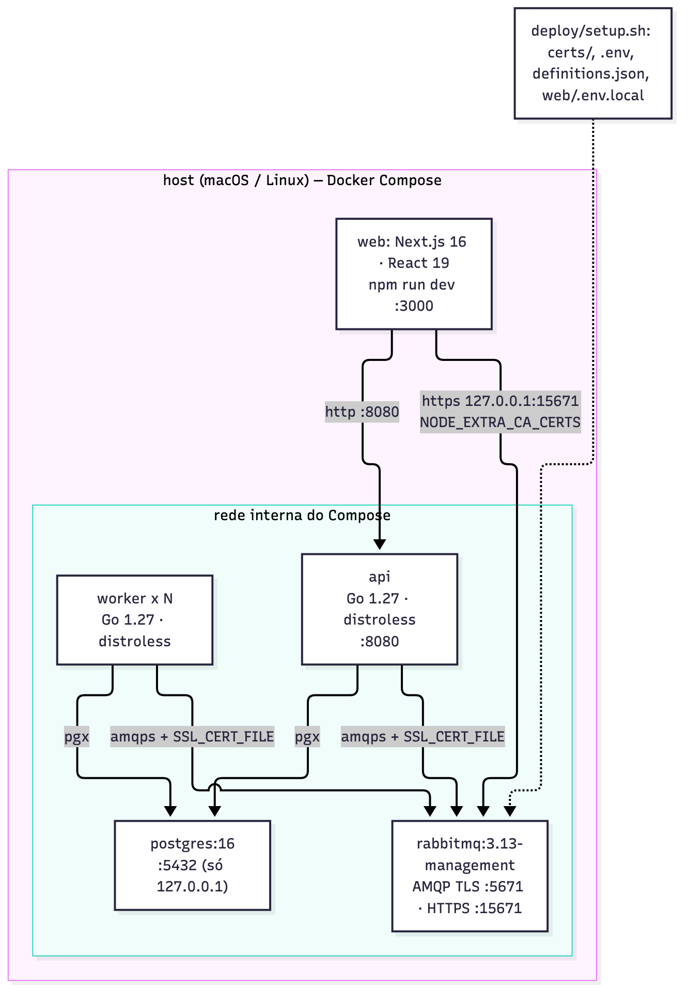

# message-queue-ecommerce
## Etapa 5: Considerações Técnicas

**Trabalho Prático de Mensageria** · Sistemas Distribuídos · FURB
Prof. Gabriel Castellani

---

## 1. Tecnologias

| Camada | Escolha | Motivo |
|---|---|---|
| Linguagem | Go 1.27 | gera um binário único; goroutines facilitam consumir várias filas ao mesmo tempo; HTTP e UUID já vêm na biblioteca padrão |
| Cliente AMQP | `rabbitmq/amqp091-go` v1.15.0 | cliente oficial do RabbitMQ, com *publisher confirms* e *ack* manual |
| Banco (driver) | `jackc/pgx/v5` v5.11.0, via `database/sql` | driver PostgreSQL mais usado em Go |
| HTTP | `net/http` | o roteador da biblioteca padrão já entende método e parâmetro de caminho; não precisamos de framework |
| Broker | RabbitMQ 3.13 | exchanges `topic`, TTL e *dead-lettering* resolvem roteamento, retentativa e expiração sem código extra; tem TLS e Management UI |
| Banco de dados | PostgreSQL 16 | transações e `UPDATE` atômico sustentam a reserva de estoque, a idempotência e o *compare-and-set* |
| Ambiente | Docker Compose | sobe tudo com um comando; `--scale worker=N` demonstra a escala |
| Segurança | OpenSSL, via `deploy/setup.sh` | gera a CA, o certificado e as senhas |
| Interface web | Next.js 16, React 19, TypeScript, Tailwind CSS 4 | o Mapa de Mensagens, que anima o fluxo a partir da Management API; é opcional e só observa |

O backend tem só as duas dependências do `go.mod`.



**Organização do código.** Um módulo Go gera um único binário, que roda como `api` ou
como `worker` conforme o argumento. As dependências seguem um sentido só:
`cmd/shop` usa os pacotes `api`, `stock`, `payment` e `notification`, que usam `mq`
(mensageria) e `store` (banco).

```
cmd/shop/main.go         escolhe o modo (api ou worker) e conecta no banco
internal/mq/             nomes da topologia, envelope, publicação, consumo, retentativa e DLQ
internal/store/          status do pedido, transações, idempotência e compare-and-set
internal/stock/          reserva e liberação de estoque
internal/payment/        pagamento simulado
internal/notification/   notificação (log)
internal/api/            rotas HTTP e a documentação em /docs
deploy/                  docker-compose, init.sql, rabbitmq.conf, definições e setup.sh
web/                     Mapa de Mensagens
```

O backend não tem testes automatizados em Go. A verificação é feita pelos 17 casos da
Etapa 4, executados contra o ambiente real. A interface web tem testes do cálculo do
fluxo (`npm test`).

## 2. Formato das mensagens

Toda mensagem é um envelope JSON, e a *routing key* é igual ao campo `type`:

```json
{"id":"85108112-73d1-4d81-a6e1-2457edb05a52","type":"payment.approved","order_id":"d93c8d8e-e941-4958-bd36-364fa06fbebc","data":{"transaction_id":"TX-449a84f9","amount_cents":24990}}
```

| Campo | Conteúdo |
|---|---|
| `id` | UUID novo por mensagem; é a chave de idempotência |
| `type` | tipo do evento, igual à *routing key* |
| `order_id` | UUID do pedido; também serve para seguir um pedido nos logs |
| `data` | dados do evento; `{}` quando não há nada. Só o `payment.approved` usa (`transaction_id`, `amount_cents`) |

As propriedades AMQP completam o envelope: `message_id` (igual ao `id`),
`content_type: application/json`, `timestamp` e `delivery_mode: 2` (persistente). Os
seis tipos de evento e quem publica e consome cada um estão na Etapa 2, §2.1.

Uma mensagem com JSON inválido, ou com `id` ou `order_id` que não seja UUID, é rejeitada
na leitura e vai direto para a DLQ (caso 14 da Etapa 4).

### 2.1 Por que JSON e não Avro ou Protobuf

| Critério | JSON | Avro ou Protobuf |
|---|---|---|
| Infraestrutura | nenhuma; `encoding/json` da biblioteca padrão | Avro precisa de *schema registry*; Protobuf precisa de `.proto` e geração de código |
| Leitura | legível na Management UI, na DLQ e nos logs; foi assim que inspecionamos as mensagens na Etapa 4 | binário; ler exige o esquema e uma ferramenta |
| Tamanho | 127 bytes (`order.placed`) a 182 bytes (`payment.approved`) | menor, porque não leva o nome dos campos |
| Desempenho | suficiente: o gargalo é o pagamento (segundos), não a serialização (microssegundos) | mais rápido, sem diferença perceptível aqui |
| Validação | feita pelo consumidor ao ler | feita pelo esquema |

Com mensagens pequenas, seis tipos de evento e um único sistema publicando e
consumindo, o ganho do Avro ou do Protobuf não compensa a infraestrutura extra nem a
perda de legibilidade. Valeria a pena com volume muito maior ou com várias equipes
publicando nos mesmos tópicos.

### 2.2 Evolução do formato

- **Mudanças compatíveis só acrescentam campos** em `data`. O `encoding/json` ignora
  campos desconhecidos, então versões antigas e novas convivem durante uma
  implantação.
- **Uma mudança incompatível vira um tipo novo**, por exemplo `payment.approved.v2`,
  publicado em paralelo até todos os consumidores migrarem. Por isso o envelope não tem
  campo `version`: o `type` já é o contrato.

## 3. Boas práticas

| Prática | Como fizemos | Onde |
|---|---|---|
| *Ack* manual depois do banco | `autoAck=false`; *ack* só depois que o handler grava e faz `COMMIT` | `internal/mq/consume.go` |
| *Publisher confirms* | canal em modo `confirm`; sem *ack* do broker em 5 s, a publicação falha | `internal/mq/publish.go` |
| Persistência | exchanges e filas duráveis, mensagens com `delivery_mode: 2` | `definitions.tmpl.json`, `mq.Publish` |
| Publicar antes do `COMMIT` | `api`, `stock` e `payment` publicam dentro da transação; se a publicação falha, nada é gravado | `api.checkout`, `stock`, `payment` |
| Idempotência | `processed_messages` gravada na mesma transação do efeito | `store.MarkProcessed` |
| *Compare-and-set* do status | trava a linha (`FOR UPDATE`) e só muda se o status for o esperado | `store.CASStatus` |
| Estoque atômico | `UPDATE ... AND available >= $1`, todos os itens na mesma transação, sempre na mesma ordem | `internal/stock` |
| `prefetch = 10` | limita mensagens sem *ack* e distribui a carga | `consume` |
| Um canal por fila | canais AMQP não podem ser usados em paralelo | `consume` |
| Mensagem inválida vai à DLQ | sem retentar o que não tem conserto | `decode`, `toDLQ` |
| Retentativa com espera | TTL e *dead-lettering*, 3 tentativas contadas pelo `x-death` | políticas, `deathCount` |
| Topologia fora do código | carregada pelo broker a partir do `definitions.json` | `deploy/` |
| Menor privilégio e TLS | um usuário por componente; só portas TLS; senhas fora do git | `rabbitmq.conf`, `setup.sh` |
| Reconexão | espera de 1 s dobrando até 30 s | `mq.Connect`, `RunConsumers` |
| Parada graciosa | no `SIGTERM`, termina a mensagem em andamento antes de sair | `main`, `RunConsumers` |
| Pool limitado | no máximo 20 conexões com o banco por processo | `openDB` |
| Dinheiro em centavos | `int64`, com o preço congelado ao adicionar o item | `order_items.price_cents` |

## 4. API HTTP

A própria `api` serve a documentação interativa em **http://localhost:8080/docs**
(OpenAPI). As rotas são:

| Rota | O que faz |
|---|---|
| `POST /carts` | cria um carrinho |
| `POST /carts/{id}/items` | adiciona ou substitui um item |
| `POST /carts/{id}/checkout` | `CART → PLACED` e publica `order.placed`; `201` só depois do *confirm*, `503` se o broker não confirmar |
| `GET /orders/{id}` | status, itens, total e o histórico de entregas ao `worker` |
| `GET /products` | produtos e estoque |
| `POST /products/{id}/stock` | repõe estoque |

O checkout não confere o estoque: quem decide é a reserva no `stock`, e o resultado
aparece em `GET /orders/{id}`.

## 5. Limitações

- **Não há cancelamento de pedido.** O ajuste pedido pelo professor
  (`docs/adjustents.md`) fala em manter a reserva "até finalizar ou cancelar". Hoje o
  estoque só volta por pagamento recusado ou por expiração. Uma rota
  `POST /orders/{id}/cancel` publicando um evento tratado pela liberação resolveria.
- **Os handlers escalam juntos.** O mesmo processo consome as três filas, então
  `--scale worker=N` escala todas. Dentro de um processo cada fila é consumida em
  sequência; o `prefetch` não é paralelismo.
- **Pode sair evento a mais.** Se o processo cair entre publicar e fazer `COMMIT`, sai
  um evento de uma mudança não gravada. O consumidor seguinte o descarta pelo
  *compare-and-set* (caso 15 da Etapa 4). O padrão *Outbox* resolveria, se algum
  consumidor externo sem essa proteção passar a ouvir os eventos.
- **Mensagem sem rota se perde.** A publicação usa `mandatory=false`. Hoje toda
  *routing key* tem fila ligada, mas um erro de configuração faria a mensagem sumir sem
  aviso. Com produtores de outras equipes, valeria usar `mandatory=true`.
- **Retentativa duplica avisos.** A mensagem que volta do `retry` chega de novo a todas
  as filas ligadas, e o `notification` registra o evento outra vez. O estado continua
  correto.
- **Sem ordem entre filas.** Eventos do mesmo pedido podem ser processados fora de
  ordem; o *compare-and-set* descarta o atrasado.
- **Banco sem TLS e broker sem volume.** A conexão com o PostgreSQL não é cifrada (fica
  na rede do Compose e no próprio computador). As mensagens persistentes sobrevivem a
  um `restart` do RabbitMQ (caso 9), mas não a um `docker compose down`, porque o broker
  não tem volume de dados.
- **Broker com um nó só.** É o ponto único de falha; um cluster com filas *quorum*
  resolveria.
