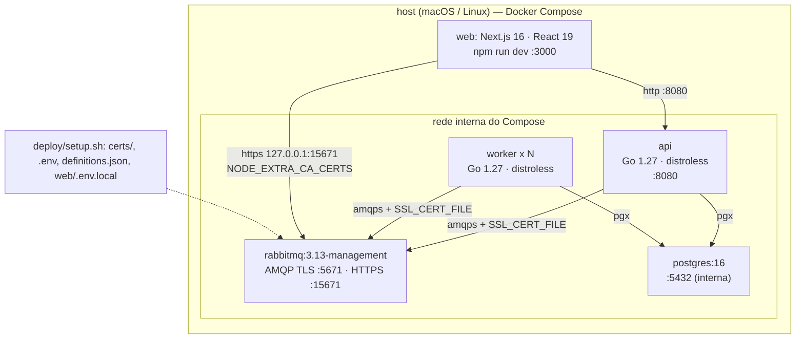

# message-queue-ecommerce
## Etapa 5 — Documentação Técnica

**Trabalho Prático — Mensageria** · Sistemas Distribuídos · FURB
Prof. Gabriel Castellani · Entrega: 24/09/2026

---

## 1. Stack

| Camada | Escolha | Por quê |
|---|---|---|
| Linguagem | Go 1.27 | Binário único e estático; concorrência simples com goroutines; `uuid` e roteamento HTTP na biblioteca padrão |
| Cliente AMQP | `github.com/rabbitmq/amqp091-go` v1.15.0 | Cliente oficial mantido pela equipe do RabbitMQ; suporta publisher confirms e ack manual |
| Banco (driver) | `github.com/jackc/pgx/v5` v5.11.0 via `database/sql` (driver `pgx`) | Driver Postgres mais usado em Go; `database/sql` mantém a interface padrão de transações |
| HTTP | `net/http` (biblioteca padrão) | O `ServeMux` já roteia por método e parâmetro de caminho (`POST /carts/{id}/checkout`); sem framework |
| Broker | RabbitMQ 3.13 (`rabbitmq:3.13-management`) | Exchanges `topic`, políticas de TTL e *dead lettering* cobrem roteamento, retentativa e expiração sem código extra; TLS nativo; Management UI para demonstração |
| Banco de dados | PostgreSQL 16 | Transações e `UPDATE` atômico sustentam idempotência, compare-and-set e reserva de estoque |
| Ambiente | Docker Compose | Sobe broker, banco, `api` e `worker` com um comando; `--scale worker=N` demonstra consumidores concorrentes |
| Segurança | OpenSSL (`deploy/setup.sh`) | Gera a CA, o certificado TLS do broker e as senhas aleatórias; nenhuma ferramenta extra |
| Interface web (`web/`) | Next.js 16.3, React 19.2, TypeScript, Tailwind CSS v4, `motion` | Mapa de Mensagens: anima a topologia a partir dos contadores da Management API (proxy no servidor do Next, usuário `monitor`, HTTPS); só observa, não produz nem consome mensagens. Testes com `node --test` |

Dependências externas do backend: apenas as duas de `go.mod`. A interface web
tem as suas próprias em `web/package.json` e é opcional para o sistema
funcionar.


<details>
<summary>Fonte Mermaid (<code>diagramas/implantacao.mmd</code>)</summary>



</details>

## 2. Estrutura do código

Um módulo Go, **um binário** e um pacote por módulo. O mesmo binário roda em
dois modos: `/app api` e `/app worker`; o Compose só muda o `command`.

```
cmd/shop/main.go                        modo "api" | "worker", variáveis de ambiente, conexão com o banco
internal/mq/mq.go                       nomes (exchanges, filas, routing keys), Envelope, Handler, ErrPermanent
internal/mq/publish.go                  Connect, OpenChannel, Publish, Publisher
internal/mq/consume.go                  RunConsumers, consume, deathCount, toDLQ
internal/store/store.go                 status do pedido, Item, LoadItems, TotalCents, WithTx, MarkProcessed, CASStatus
internal/stock/stock.go                 stock.Handler: reserve / release
internal/payment/payment.go             payment.Handler
internal/notification/notification.go   notification.Handler
internal/api/api.go                     api.Run: 5 rotas HTTP
Dockerfile                              build em duas etapas; imagem final distroless
deploy/docker-compose.yml               rabbitmq, postgres, api, worker
deploy/init.sql                         esquema e produto de exemplo
deploy/rabbitmq.conf                    listeners TLS, certificados, load_definitions
deploy/definitions.tmpl.json            usuários, permissões, políticas, exchanges, filas e bindings (senhas como marcadores)
deploy/setup.sh                         gera certs/, .env, definitions.json e web/.env.local (fora do git)
web/                                    Mapa de Mensagens (Next.js): app/, components/, lib/ (topologia e cálculo do fluxo)
```

**Dependências em um só sentido:** `cmd/shop` → `api`, `stock`, `payment`,
`notification` → `mq`, `store`. Os pacotes `mq` e `store` não importam nada do
projeto, então a mensageria e o acesso ao banco podem ser lidos isoladamente.
O backend não tem testes automatizados em Go: a verificação é feita pelos 17
casos de uso executados contra o ambiente real (Etapa 4); a interface web tem
testes do cálculo do fluxo (`npm test`). Só é exportado o que outro pacote usa; o resto fica privado ao
pacote (`consume`, `reserve`, `release`, `deathCount`).

## 3. Formato das mensagens

Toda mensagem é um envelope JSON (`mq.Envelope`, criado por `mq.NewEnvelope`).
A routing key é sempre igual ao campo `type`.

```json
{"id":"8c59d45e-64c8-451c-855d-0f0310cd5de7","type":"order.placed","order_id":"ba27d8b0-707e-4a77-8ab1-b600a8d4ff20","data":{}}
```

| Campo | Conteúdo |
|---|---|
| `id` | UUID novo por mensagem; chave de idempotência (`processed_messages`) |
| `type` | tipo do evento, igual à routing key |
| `order_id` | UUID do pedido |
| `data` | dados do evento; `{}` quando não há dados (nunca `null`) |

Único evento com `data` preenchido, o `payment.approved`:

```json
{"id":"1139f614-7c57-4761-a530-720d77806007","type":"payment.approved","order_id":"6a346efc-81c5-4153-9c58-973ade5a1fb8","data":{"transaction_id":"TX-57e1a74b","amount_cents":24990}}
```

Propriedades AMQP definidas por `mq.Publish`:

| Propriedade | Valor |
|---|---|
| `message_id` | o `id` do envelope |
| `content_type` | `application/json` |
| `timestamp` | hora da publicação |
| `delivery_mode` | `2` (persistente) |

Os 6 tipos de evento:

| `type` | Produtor | Exchange | Consumidores | `data` |
|---|---|---|---|---|
| `order.placed` | `api` (checkout) | `orders` | `stock`, `notification` | `{}` |
| `reservation.created` | `stock` | `orders` | `payment`, `notification` | `{}` |
| `reservation.rejected` | `stock` (sem estoque) | `orders` | `notification` | `{}` |
| `reservation.expired` | `stock` (junto com a reserva) | `expiry` → `orders` após 120 s | `stock`, `notification` | `{}` |
| `payment.approved` | `payment` | `orders` | `notification` | `{"transaction_id","amount_cents"}` |
| `payment.declined` | `payment` | `orders` | `stock`, `notification` | `{}` |

Mensagem com JSON inválido, ou com `id`/`order_id` que não é UUID, é rejeitada
por `decode` e vai direto para a DLQ (Etapa 4, caso 14).

### 3.1 Por que JSON, e não Avro ou Protobuf

| Critério | JSON | Avro / Protobuf |
|---|---|---|
| Infraestrutura | Nenhuma: `encoding/json` da biblioteca padrão | Avro precisa de *schema registry* (ou do esquema junto de cada mensagem); Protobuf precisa de arquivos `.proto` e geração de código em cada linguagem |
| Legibilidade | O corpo aparece legível na Management UI, na DLQ e nos logs — é assim que a Etapa 4 inspeciona mensagens | Binário: inspecionar exige o esquema e uma ferramenta |
| Tamanho | 127 bytes (`order.placed`) a 182 bytes (`payment.approved`) | Menor: binário, sem nomes de campo no corpo |
| Desempenho | Suficiente: o gargalo é o gateway de pagamento (segundos), não a serialização (microssegundos) | Mais rápido, sem efeito perceptível aqui |
| Contrato | Verificado no consumidor (`decode`: JSON válido, `id` e `order_id` UUID) | Verificado pelo esquema na serialização |

Com envelopes pequenos, seis tipos de evento e um único sistema produzindo e
consumindo, o ganho de tamanho e velocidade do Avro/Protobuf não paga a
infraestrutura e a perda de legibilidade. Seria reavaliado com volume muito
maior ou com equipes diferentes publicando nos mesmos tópicos, quando um
esquema central passa a valer o custo.

### 3.2 Evolução do formato (versionamento)

- **Mudanças compatíveis só adicionam campos** em `data`. O consumidor é um
  *tolerant reader*: `encoding/json` ignora campos desconhecidos e deixa o valor
  zero nos ausentes, então produtor novo e consumidor antigo (e vice-versa)
  convivem durante uma implantação.
- **Mudança incompatível vira um novo tipo** (routing key), por exemplo
  `payment.approved.v2`, publicado em paralelo até todos os consumidores
  migrarem; o binding novo é adicionado ao `definitions.json` sem tocar no
  antigo. Por isso não há campo `version` no envelope: o `type` já é o contrato.
- **Correlação.** O `order_id` faz o papel de *correlation id*: todos os
  eventos de um pedido o carregam, e é por ele que os logs da Etapa 4 seguem um
  pedido de ponta a ponta. O `id` identifica a mensagem; o `order_id`, a
  conversa.

## 4. Boas práticas

As regras de implementação do projeto e onde cada uma está no código:

| # | Regra | Como | Onde |
|---|---|---|---|
| 1 | Ack manual depois da escrita no banco | `autoAck=false`; ack só depois que o handler retorna sem erro (o handler só retorna depois do commit) | `consume` |
| 2 | Publisher confirms | Canal em modo confirm; sem `ack` do broker em 5 s, a publicação falha | `mq.OpenChannel`, `mq.Publish` |
| 3 | Filas duráveis e mensagens persistentes | Filas e exchanges `durable`; `delivery_mode` 2 | `deploy/definitions.tmpl.json`, `mq.Publish` |
| 4 | Idempotência antes do efeito, na mesma transação | `INSERT INTO processed_messages ... ON CONFLICT DO NOTHING`; repetida → registra e ignora | `store.MarkProcessed` dentro do `store.WithTx` de cada handler |
| 5 | `prefetch = 10` | `Qos(10, 0, false)` em cada canal consumidor | `consume` |
| 6 | Estoque com `UPDATE` atômico | `available = available - $1 WHERE ... AND available >= $1`; todos os itens em uma transação, em ordem de `product_id` | `reserve`, `release` |
| 7 | Compare-and-set de status | Trava a linha do pedido (`SELECT ... FOR UPDATE`), compara com o status anterior permitido e só então atualiza | `store.CASStatus` |
| 8 | Um canal AMQP por handler | Cada fila consome no próprio canal, e o handler publica nesse canal | `consume` |
| 9 | Erro de desserialização → DLQ | JSON inválido ou ids que não são UUID vão direto para o `dlx`, sem retentativa | `decode`, `toDLQ` |
| 10 | Dinheiro em centavos (`int64`) | Preço congelado em `order_items.price_cents` ao adicionar o item; total por `store.TotalCents` | `api.Run` (rota de itens), `store.TotalCents` |
| 11 | Parada graciosa | `signal.NotifyContext` com `SIGTERM`; `http.Server.Shutdown` no `api`; `mq.RunConsumers` espera a mensagem em andamento | `main`, `api.Run`, `mq.RunConsumers` |
| 12 | Reconexão com espera crescente | 1 s dobrando até 30 s, inclusive entre tentativas que falham depois de conectar | `mq.Connect`, `mq.RunConsumers` |
| 13 | `reservation.expired` publicado junto com a reserva | Publicado no `expiry` dentro da transação da reserva; `expiry.q` o segura por 120 s | `reserve` |
| 14 | Publicar antes do `COMMIT` | `api`, `stock` e `payment` publicam (com *confirm*) dentro da transação; falha no *publish* desfaz tudo, inclusive o registro de idempotência | `checkout`, `transition`, `payment.Handler` |
| 15 | Topologia e políticas fora do código | Exchanges, filas, bindings e políticas de TTL/DLX no `definitions.json`, carregado pelo broker | `deploy/definitions.tmpl.json` |
| 16 | Menor privilégio e TLS | Um usuário por componente, sem `configure`; só listeners TLS; senhas geradas fora do git | `deploy/rabbitmq.conf`, `deploy/setup.sh` |
| 17 | Pool de conexões limitado | `SetMaxOpenConns(20)`: rajadas esperam por conexão em vez de estourar o `max_connections` do PostgreSQL | `openDB` |
| 18 | Conexão e canal reaproveitados | A `api` mantém uma conexão e um canal de *confirm* (protegido por *mutex*) e só reabre quando o broker os derruba; o `worker` usa uma conexão e um canal por fila | `mq.Publisher`, `mq.RunConsumers` |

**Retentativa.** Falha transitória → `Nack` sem requeue → `retry.q` (10 s) →
volta ao `orders`. A 3ª falha na mesma fila (contada pelo header `x-death`,
em `deathCount`) vai para a DLQ. Falha permanente (`mq.ErrPermanent`) vai
direto para a DLQ.

## 5. API HTTP

JSON na entrada e na saída; sem autenticação.

| Método | Caminho | Corpo | Sucesso | Erros |
|---|---|---|---|---|
| POST | `/carts` | — | `201 {"id":"uuid","status":"CART"}` | — |
| POST | `/carts/{id}/items` | `{"product_id":"uuid","quantity":1}` | `201` com o item (`product_id`, `quantity`, `price_cents`); repetir o produto substitui a quantidade | `404` carrinho ou produto inexistente · `409` pedido não está em `CART` · `400` corpo inválido ou `quantity <= 0` |
| POST | `/carts/{id}/checkout` | — | `201 {"id":"uuid","status":"PLACED"}` depois do confirm do broker | `404` · `409` não está em `CART` ou carrinho vazio · `503` broker não confirmou (pedido continua `CART`) |
| GET | `/orders/{id}` | — | `200 {"id","status","items":[{"product_id","quantity","price_cents"}],"total_cents"}` | `404` |
| GET | `/products` | — | `200 [{"id","name","price_cents","available"}]`, ordenado por `name` | — |

O checkout **não** verifica estoque: a reserva atômica no `stock` é o único
controle, e o resultado (`RESERVED`, `OUT_OF_STOCK`, `PAID`, `DECLINED`,
`EXPIRED`) é consultado pelo `GET /orders/{id}`. Erros vêm como
`{"error":"..."}`.

## 6. Limitações

- **Sem cancelamento de pedido.** O pedido do professor
  (`docs/adjustents.md`) prevê que a pré-reserva dure "até dar timeout ... ou
  até finalizar/cancelar". O estoque só é liberado por recusa do pagamento
  (`payment.declined`) ou expiração (`reservation.expired`); não há rota nem
  evento de cancelamento. *Quando adicionar:* quando o cliente precisar
  desistir antes dos 120 s — uma rota `POST /orders/{id}/cancel` que publica
  um evento tratado por `release`.
- **Escala conjunta dos handlers.** `--scale worker=N` escala `stock`,
  `payment` e `notification` juntos, porque o mesmo processo consome as três
  filas. Cada fila é consumida por uma goroutine por processo, em sequência: o
  `prefetch = 10` limita o que fica reservado para o consumidor, não é
  paralelismo dentro do processo. *Quando adicionar:* variável `ROLES` para escolher as filas por
  instância, quando uma fila precisar escalar separada (corte do PRD §8).
- **Eventos extras no intervalo entre *publish* e *commit* (sem Outbox).** Os
  produtores publicam antes do `COMMIT` (regra 14), então não há evento
  perdido; o custo é o inverso: se o processo cair depois de publicar e antes
  do `COMMIT`, sai um evento de uma mudança que não foi gravada. O consumidor
  seguinte o descarta pelo *compare-and-set* (caso 15 da Etapa 4: um
  `refund simulated` sem cobrança). *Quando adicionar:* padrão Outbox, se um
  consumidor externo, sem *compare-and-set*, passar a ouvir esses eventos.
- **Mensagem sem rota é descartada em silêncio.** As publicações usam
  `mandatory=false` e não tratam `basic.return`: uma routing key sem fila
  ligada seria confirmada pelo broker e descartada. Hoje não acontece — toda
  routing key publicada tem binding no `definitions.json`. *Quando
  adicionar:* `mandatory=true` + `NotifyReturn` quando houver produtores de
  outras equipes.
- **Sem garantia de ordem entre filas.** Eventos do mesmo pedido em filas
  diferentes podem ser processados fora de ordem; o *compare-and-set* torna
  isso inofensivo (Etapa 2, §3).
- **Cópias na retentativa.** A retentativa devolve a mensagem ao `orders`, que
  a entrega de novo a todas as filas ligadas: `notification` registra o mesmo
  evento outra vez. Idempotência e compare-and-set mantêm o estado correto;
  só o log se repete.
- **Disputa pela última unidade.** Quando dois clientes disputam a última
  unidade, um fica `OUT_OF_STOCK` e o outro fica com a reserva — mas o
  vencedor ainda pode ter o pagamento recusado (~15 %) e terminar `DECLINED`,
  com a unidade devolvida ao estoque.
- **PostgreSQL sem TLS.** O broker usa só TLS (Etapa 3, §8), mas a conexão
  com o banco é `sslmode=disable`, restrita à rede interna do Compose.
  *Quando adicionar:* banco fora dessa rede (`sslmode=verify-full`).
- **Sem volume de dados no RabbitMQ.** Mensagens persistentes sobrevivem a
  `restart` (caso 9), mas não a `docker compose down`. *Quando adicionar:*
  volume para `/var/lib/rabbitmq` fora do ambiente de avaliação.
- **Broker com um único nó.** O RabbitMQ é ponto único de falha.
  *Quando adicionar:* cluster com *quorum queues* quando houver mais de um nó
  (PRD §8).
